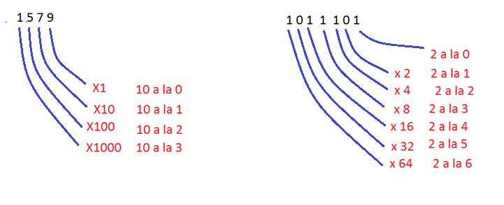
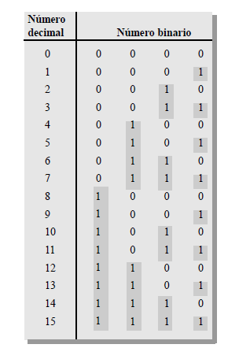
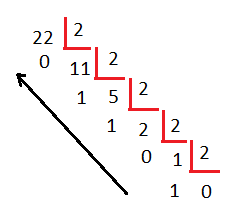

# electronica_basica
 Curso de prueba
SISTEMA DE NUMERACIÓN BINARIA

El sistema de numeración binario es simplemente otra forma de
representar magnitudes. Es menos complicado que el sistema decimal
porque sólo emplea dos dígitos. El sistema decimal con sus diez dígitos
es un sistema en base diez; el sistema binario con sus dos dígitos es un
sistema en base dos. Los dos dígitos binarios (bits) son 1 y 0. La
posición de un 1 o un 0 en un número binario indica su peso; o valor
dentro del número, del mismo modo que la posición de un dígito decimal
determina el valor de ese dígito. Los pesos de un número binario se
basan en las potencias de dos. Se puede hablar de ON-OFF,
Falso-Verdadero, Alto-Bajo, etc.

{width="6.1375in" height="2.5027777777777778in"}

TABLA ASOCIADA DE DECIMAL A BINARIO

{width="3.5208333333333335in"
height="4.893737970253718in"}

CONVERSIÓN DE DECIMAL A BINARIO

Convertir un número decimal al sistema binario es muy sencillo: debemos
realizar divisiones por 2 colocando el resto y volviendo a dividir el
cociente por 2 así sucesivamente hasta no tener dividendo.

Por ejemplo, para convertir al sistema binario el número 2210 haremos
una serie de divisiones que entrega los restos siguientes:

{width="2.46875in" height="2.1354166666666665in"}

Tomando los restos en orden inverso o sea de abajo hacia arriba
obtenemos las cifras binaria que es:

$$22_{10} = \ 10110_{2}$$
