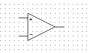
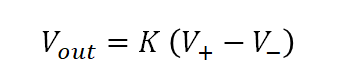
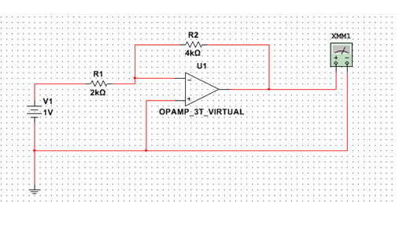
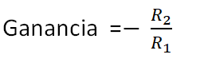
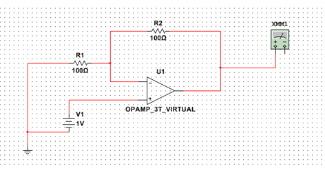
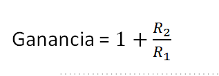

<b> Universidad Escuela Colombiana de Ingeniería Julio Garavito</b>
 

Henry Moreno Mosquera
 

Profesor del Centro de Estudios Electrónicos
 

henry.moreno@escuelaing.edu.co
 

# **CURSO DE ELECTRONICA BASICA PARA INGENIEROS. MODULO 1. AMPLIFICADORES OPERACIONALES**

## Amplificador Operacional

Un amplificador operacional, comúnmente conocido como "op-amp" (abreviatura de operational amplifier en inglés), es un dispositivo electrónico con dos entradas y una sola salida, diseñado para amplificar señales eléctricas. Es uno de los componentes más importantes en la electrónica analógica y se utiliza ampliamente en circuitos para realizar diversas funciones, como amplificación, sumas, restas, integración, derivación, entre otras.

El símbolo esquemático del amplificador operacional es un triángulo con dos entradas marcadas (+ y -) y una salida:

  

Las dos entradas del op-amp son:

La entrada no inversora (+): Es la terminal donde se aplica la señal de entrada que se quiere amplificar. La señal en esta entrada no se invierte.

La entrada inversora (-): Es la terminal donde se aplica la señal de retroalimentación o la señal de entrada si se desea amplificar con inversión. La señal en esta entrada se invierte y se compara con la señal en la entrada no inversora.

La salida del amplificador operacional se genera como una amplificación de la diferencia de voltaje entre las dos entradas, multiplicada por un factor de ganancia K):

  

El valor de K es muy grande, típicamente 10^5

En teoría, el valor de ganancia (K) es infinito, pero en la práctica, los amplificadores operacionales tienen una ganancia muy alta. Por lo tanto, cualquier pequeña diferencia entre las dos entradas generará una salida amplificada significativamente.

Los amplificadores operacionales se alimentan con una fuente de voltaje dual (por ejemplo, +Vcc y -Vcc) para permitir la amplificación de señales tanto positivas como negativas.

Es importante destacar que el amplificador operacional ideal tiene características ideales, como alta impedancia de entrada, ganancia infinita, ancho de banda infinito y rechazo infinito del modo común. Sin embargo, en la práctica, los amplificadores operacionales reales tienen limitaciones debido a la tecnología y otros factores, y estas limitaciones se tienen en cuenta al diseñar y utilizar circuitos con op-amps.

### Amplificador Inversor

El amplificador inversor es un tipo de configuración de amplificador operacional (op-amp) muy común y ampliamente utilizado en circuitos electrónicos. La función principal del amplificador inversor es invertir la polaridad de la señal de entrada aplicada a su terminal de entrada, es decir, si la señal de entrada aumenta, la señal de salida disminuirá proporcionalmente, y viceversa.

La configuración básica del amplificador inversor consta de dos elementos principales: el amplificador operacional y dos resistencias. La señal de entrada se aplica al terminal de entrada no inversor (+) del amplificador operacional, mientras que el terminal de entrada inversor (-) está conectado a tierra o referencia de voltaje.

Aquí tienes el diagrama esquemático del amplificador inversor:

  

Vin: Señal de entrada.
Vout: Señal de salida.
R1 y R2: Resistencias conectadas en la configuración de realimentación.
Vref: Referencia de voltaje (normalmente conectada a tierra).
La ganancia del amplificador inversor se calcula mediante la siguiente fórmula:

  

Es importante notar que la ganancia será siempre positiva debido al valor absoluto en la fórmula. Sin embargo, como la señal se invierte, su polaridad será opuesta a la señal de entrada.

La configuración del amplificador inversor tiene varias aplicaciones en electrónica, como amplificación de señales, filtros activos, generadores de onda y más. Al elegir los valores de las resistencias R1 y R2, puedes ajustar la ganancia según tus necesidades específicas. Ten en cuenta que el valor de R2 generalmente es mayor que el valor de R1 para obtener una amplificación adecuada.

### Amplificaor no Inversor

El amplificador no inversor es un tipo de amplificador operacional (op-amp) que proporciona una amplificación de señal positiva sin invertir su polaridad. El op-amp es un dispositivo electrónico que tiene dos entradas (inversora y no inversora) y una salida.

El amplificador no inversor utiliza una configuración específica en la que la señal de entrada se aplica a la entrada no inversora (+) del op-amp, mientras que la entrada inversora (-) se conecta a una referencia de voltaje, generalmente a tierra (GND). La salida del amplificador se toma desde el terminal de salida y puede estar conectada a un circuito de carga o utilizarse como señal de salida amplificada.

La ganancia del amplificador no inversor se determina mediante dos resistencias: una resistencia R1 conectada desde la entrada no inversora (+) a la entrada de la señal y una resistencia R2 conectada entre la salida del op-amp y la entrada no inversora (+).

El circuito está descrito acontinuación:

  

La fórmula para calcular la ganancia del amplificador no inversor es:

  

Algunas características importantes del amplificador no inversor son:

Ganancia estable y predecible: La ganancia del amplificador está determinada por el valor de las resistencias R1 y R2, lo que permite un control preciso de la amplificación.

Alta impedancia de entrada: La entrada no inversora tiene una alta impedancia, lo que significa que carga mínimamente la fuente de señal.

Bajo ruido: Los amplificadores operacionales generalmente tienen bajos niveles de ruido, lo que es beneficioso para aplicaciones que requieren una alta relación señal-ruido.

Mayor rango de voltaje de salida: El amplificador no inversor puede proporcionar una amplificación positiva de la señal de entrada, lo que permite obtener una señal de salida con un rango de voltaje mayor en comparación con un amplificador inversor.

Es importante tener en cuenta que los amplificadores operacionales ideales tienen características ideales y suponen una diferencia de potencial (tensión) nula entre sus entradas. En la práctica, los op-amps reales tienen limitaciones y se deben considerar ciertas restricciones para obtener un rendimiento óptimo en las aplicaciones.

### Control de versiones

| Versión    | Descripción   | Autor                                      | Horas |
|------------|:--------------|--------------------------------------------|:-----:|
| 2023.07.31| Versión No. 1 | [Henry Moreno](https://github.com/hmorenom64)  |  6 |

_Curso Electronica Básica para Ingenieros es de uso libre para fines académicos.

_¡Encontraste útil este repositorio!, apoya su difusión marcando este repositorio con una ⭐ o síguenos dando clic en el botón Follow de [hmorenom64](https://github.com/hmorenom64?tab=repositories) en GitHub._

| [Anterior](diodos.md) | [:house: Inicio](../readme.md) | [:beginner: Ayuda / Colabora] | [Siguiente](tutorial_multisim.md) |
|----------------------------|-----------------------------------|--------------------------------------------------------------------------------------------------|-----------------------------------------|
                                                                                                                                      
                                                                                                                                

                                                                                                                                      
##
