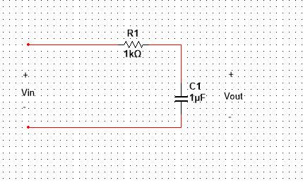
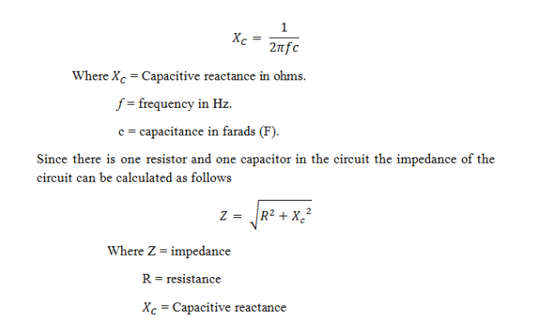
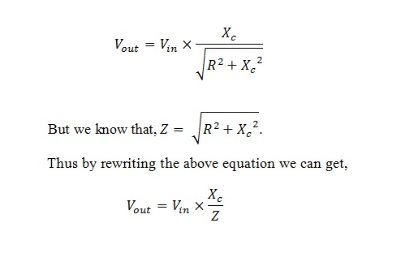
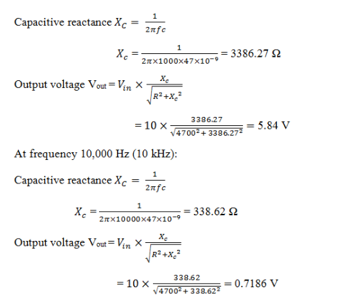
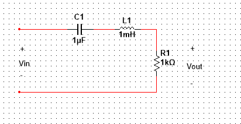
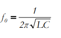
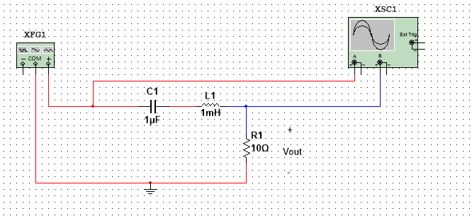
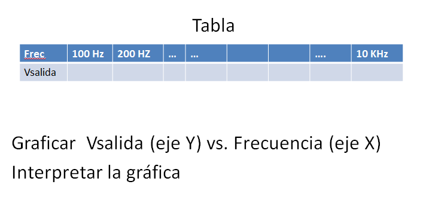

<b> Universidad Escuela Colombiana de Ingeniería Julio Garavito</b>
 

Henry Moreno Mosquera
 

Profesor del Centro de Estudios Electrónicos
 

henry.moreno@escuelaing.edu.co
 

# **CURSO DE ELECTRONICA BASICA PARA INGENIEROS. MODULO 1. CONCEPTOS DE CIRCUITOS RLC**

Los circuitos RLC son circuitos eléctricos que contienen componentes pasivos como resistencias (R), inductancias (L) y capacitancias (C). Estos circuitos son muy comunes en electrónica y tienen aplicaciones en diversos dispositivos y sistemas.

## Conceptos básicos.

Resistencia (R): Representa la oposición al flujo de corriente en el circuito y se mide en ohmios (Ω).

Inductancia (L): Representa la capacidad de almacenar energía en forma de campo magnético cuando fluye una corriente a través de una bobina. Se mide en henrios (H).

Capacitancia (C): Representa la capacidad de almacenar energía en forma de campo eléctrico cuando se aplica una tensión a un condensador. Se mide en faradios (F).

Respuesta en frecuencia: La respuesta en frecuencia de un circuito RLC se refiere a cómo el circuito reacciona a señales de diferentes frecuencias. La frecuencia es el número de ciclos completos de una onda por unidad de tiempo, y se mide en hercios (Hz). La respuesta en frecuencia describe cómo cambia la amplitud y la fase de la señal en función de la frecuencia de la señal de entrada.

Respuesta en el dominio del tiempo: La respuesta en el dominio del tiempo describe cómo se comporta el circuito en función del tiempo. Al aplicar una señal de entrada, el circuito RLC responderá con una forma de onda que puede ser transitoria o estacionaria, dependiendo de las condiciones iniciales y los componentes del circuito.

## Respuesta en frecuencia.

Para analizar la respuesta en frecuencia de un circuito RLC, se puede aplicar una señal sinusoidal como entrada y medir la amplitud y la fase de la señal de salida en diferentes frecuencias. Esto se puede representar en un gráfico llamado diagrama de Bode, que muestra la ganancia y la fase del circuito en función de la frecuencia. En un circuito RLC, habrá una frecuencia resonante en la que la amplitud de la respuesta es máxima.

## Respuesta en el dominio del tiempo.

La respuesta en el dominio del tiempo se puede analizar utilizando ecuaciones diferenciales que describen el comportamiento del circuito. Por ejemplo, para un circuito RLC en serie, la ecuación diferencial que gobierna la corriente en función del tiempo es:

L di/dt + Ri + 1/C ∫i dt = V(t)

Donde:

L es la inductancia del inductor.
R es la resistencia del resistor.
C es la capacitancia del condensador.
i(t) es la corriente en función del tiempo.
V(t) es la tensión aplicada al circuito en función del tiempo.
La solución de esta ecuación diferencial depende de las condiciones iniciales y la forma de la señal de entrada V(t).

En resumen, los circuitos RLC son fundamentales en electrónica y tienen una amplia gama de aplicaciones. La respuesta en frecuencia y la respuesta en el dominio del tiempo son dos formas importantes de analizar y entender su comportamiento en diferentes situaciones.

## Filtros

El filtro es un circuito que se usa para filtrar las señales, ya que pasará solo las señales necesarias y evitará señales no deseadas. En general, los filtros están diseñados por componentes pasivos o por componentes activos.

Los componentes pasivos son resistencias, inductores y condensadores.

Los componentes activos son transistores, FET y amplificadores operacionales.

El filtro de paso bajo es un filtro que pasará solo señales de baja frecuencia y atenuará señales de alta frecuencia. Permite señales de solo 0Hz para cortar la frecuencia ‘fc’. Este valor de frecuencia de corte dependerá del valor de los componentes utilizados en el circuito. En general, estos filtros son preferibles por debajo de 100 kHz. La frecuencia de corte también se denomina frecuencia de corte o frecuencia de giro.

### Filtros Pasa bajos

El circuito de filtro de paso bajo diseñado por componentes pasivos se conoce como filtro pasivo de paso bajo.

El filtro de paso bajo RC se muestra a continuación

  

Simplemente conectando la resistencia ‘R’ en serie con un condensador ‘C’ da RC Pass Low Filter. Simplemente puede referirse como filtro de paso bajo (LPF). La resistencia es independiente de las variaciones de las frecuencias aplicadas en el circuito pero el condensador es un componente sensible que significa que responde a los cambios en el circuito.

Dado que tiene solo un componente reactivo, este circuito también se puede denominar como ‘filtro de un polo’ o ‘filtro de primer orden’. La tensión de entrada «Vin» se aplica a todo el ciclo de la serie y la tensión de salida solo se aplica a través del condensador.

Dado que el condensador es un componente sensible, la concentración principal a observar se refiere a la «reactancia capacitiva». La reactancia capacitiva es la respuesta de la oposición creada por el condensador en el circuito.

Para mantener la capacitancia del condensador, el condensador se opondrá a una pequeña cantidad de flujo de corriente en el circuito. Esta oposición al flujo de corriente en el circuito se llama impedancia. Por lo tanto, la reactancia capacitiva disminuye con el aumento de la corriente opuesta.

Con esto podemos decir que la reactancia capacitiva es inversamente proporcional a la frecuencia aplicada al circuito. El valor resistivo de la resistencia es estable mientras que el valor de la reactancia capacitiva varía. La caída de tensión en el condensador es muy inferior en comparación con el potencial de tensión del condensador.

Esto significa que a bajas frecuencias la caída de voltaje es pequeña y el potencial de voltaje es grande, pero a altas frecuencias la caída de voltaje es muy alta y el potencial de voltaje es menor. Por este fenómeno podemos decir que el circuito anterior puede actuar como un circuito ‘divisor de voltaje de frecuencia variable’.

La reactancia capacitiva se puede formular de la siguiente manera:

  

#### Cálculo de la ecuación de salida

Para obtener la ecuación del divisor potencial, debemos considerar la impedancia, la reactancia capacitiva, el voltaje de entrada y la tensión de salida. Al usar estos términos, podemos formular la ecuación para la ecuación del divisor potencial RC de la siguiente manera

  

Al usar esta ecuación, podemos calcular el valor de la salida en cualquier frecuencia aplicada.

EJEMPLO DE FILTRO DE PASO

Examinemos estos valores de voltaje de salida y los valores de reactancia capacitiva considerando los valores de resistencia y capacitor. Deje que el valor de la resistencia R sea de 4.7kΩ y el valor del condensador como 47nF. La entrada de voltaje A.C suministrada es de 10V. Los valores de frecuencia para los que vamos a calcular son de 1 kHz y 10 kHz.

  

Con esto podemos decir claramente que cuando la frecuencia aumenta el capacitivo la reactancia disminuye No solo disminuye la reactancia capacitiva sino también la tensión de salida. Del ejemplo anterior se observa que la reactancia capacitiva se reduce de 3386,27 ohmios a 338,62 ohmios, mientras que la tensión de salida disminuyó de 5,84 voltios a 0,718 voltios con el aumento de la frecuencia de 1 kHz a 10 kHz.

Aplicaciones del Filtro Pasabajo

El uso principal de los circuitos de filtro de paso bajo es para evitar ondulaciones de CA en la salida del rectificador. El filtro de paso bajo se usa en los circuitos de amplificación de audio.

Al usar este filtro pasivo de paso bajo, podemos reducir directamente el ruido de alta frecuencia a un pequeño modo de perturbación en los sistemas estéreo.
El filtro de paso bajo como integrador se puede utilizar como conformación de onda y circuitos de generación de onda debido a la fácil conversión de un tipo de señal eléctrica en otra forma.

También se usan en circuitos demoduladores para extraer los parámetros necesarios del señales moduladas.

### Filro Pasa Bandas

Un filtro pasa banda pasivo de segundo orden RLC como su nombre lo dice solo permite el paso una banda de frecuencias y atenúa todas las demás. Esta compuesto por tres elementos, un condensador, una bobina y una resistencia. Se conoce como pasivo por que solo esta compuesto por elementos pasivos, y es de segundo orden por que contiene dos elementos reactivos ( un condensador y una bobina). Presenta tres principales características: Ganancia de uno en la frecuencia central, ganancia de 0.707 (1 sobre raiz de 2) en las frecuencias de corte, y además permite trabajar cualquier factor de calidad (selectividad) mientras los elementos del mismo lo permitan.

En la siguiente imagen se muestra el esquema del filtro:

  

La frecuencia donde el filtro permite mayor ganancia de salida, se le denomina frecuencia de resonancia. La siguiente ecuación permite dicho calculo:

  

### Taller de Evaluación

1. Implementar el siguiente circuito:

  

  

 

Y diligenciar la siguiente tabla:

  

  

 

### Control de versiones

| Versión    | Descripción   | Autor                                      | Horas |
|------------|:--------------|--------------------------------------------|:-----:|
| 2023.07.31| Versión No. 1 | [Henry Moreno](https://github.com/hmorenom64)  |  6 |

_Curso Electronica Básica para Ingenieros es de uso libre para fines académicos.

_¡Encontraste útil este repositorio!, apoya su difusión marcando este repositorio con una ⭐ o síguenos dando clic en el botón Follow de [hmorenom64](https://github.com/hmorenom64?tab=repositories) en GitHub._

| [Anterior](circuitos_resistivos.md) | [:house: Inicio](../readme.md) | [:beginner: Ayuda / Colabora] | [Siguiente](tutorial_multisim.md) |
|----------------------------|-----------------------------------|--------------------------------------------------------------------------------------------------|-----------------------------------------|
                                                                                                                                      
                                                                                                                                

                                                                                                                                      
##
