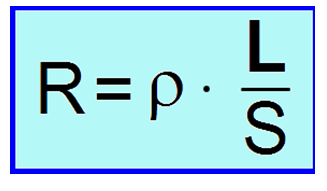
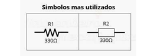
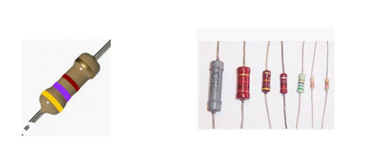
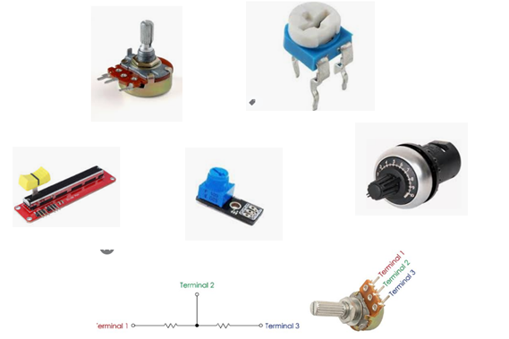
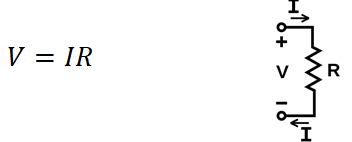
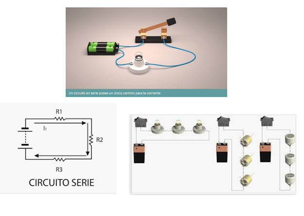
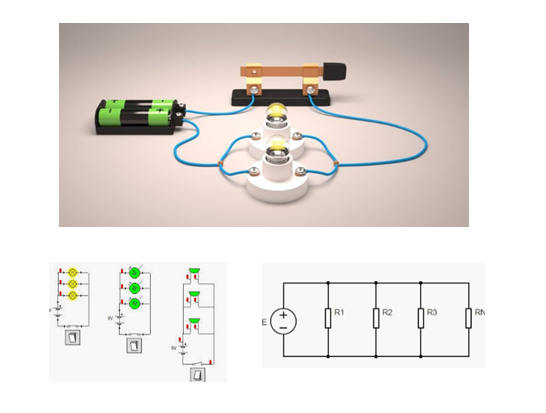

## RESISTENCIAS

Se le denomina resistencia eléctrica a la oposición al flujo de corriente eléctrica a través de un conductor.

  

Los símbolos más utilizados son:

  

Las principales imágenes

  

### Resistencias Variables

#### Potenciometros

  

### Ley de OHM

La ley de Ohm, postulada por el físico y matemático alemán George Ohm, es una ley básica de los circuitos eléctricos. Establece que la diferencia de potencial V que aplicamos entre los extremos de un conductor determinado es proporcional a la intensidad de la corriente I que circula por el citado conductor. Ohm completó la ley introduciendo la noción de resistencia eléctrica  R que es el factor de proporcionalidad que aparece en la relación entre V e I

  

### Circuitos en Serie

Se llama circuito en serie a un tipo de circuito eléctrico provisto de un único camino para la corriente, que debe alcanzar a todos los bornes o terminales conectados en la red de manera sucesiva, es decir uno detrás de otro, conectando sus puntos de salida con el de entrada del siguiente.

Igualmente se dice que dos elementos están en serie, si en la unión de los bornes de dichos elementos no sale otro elemento. Es decir que el nodo de unión solo “une” a los dos elementos

  

### Divisores de Voltaje

En los circuitos en serie, se puede dividir el voltaje de entrada, de tal forma que a través de la salida por una resistencia podamos tener una porción del voltaje de entrada.
Las leyes de Kirchhoff determinan que el voltaje de entrada en un circuito en serie se distribuye a través de todos los elementos de la malla.

𝑉_𝑖𝑛=𝑉_𝑅1+𝑉_𝑅2+  …..+𝑉_𝑅𝑛

El voltaje en cada resistencia está dado por la resistencia multiplicado por la corriente.

Como la corriente es la misma, tenemos que:

𝑉_𝑖𝑛=𝑅_1 𝐼+𝑅_2 𝐼+….+𝑅_𝑛 𝐼=𝐼(𝑅_1+…𝑅_𝑛 )
𝐼=𝑉_𝑖𝑛/(𝑅_1+…𝑅_𝑛 )

Y el voltaje en una resistencia 𝑅_𝑖 está dado por:

𝑉_𝑖=𝑅_𝑖 𝐼=𝑅_𝑖  𝑉_𝑖𝑛/(𝑅_1+…𝑅_𝑛 )

𝑽_𝒊=𝑹_𝒊/(𝑹_𝟏+…𝑹_𝒏 ) 𝑽_𝒊𝒏

### Circuitos en Paralelo

Cuando hablamos de un circuito en paralelo o una conexión en paralelo, nos referimos a una conexión de dispositivos eléctricos (como bobinas, generadores, resistencias, condensadores, etc.) colocados de manera tal que tanto los terminales de entrada o bornes de cada uno, como sus terminales de salida, coincidan entre sí.

  

### Divisores de Corriente

En los circuitos en paralelo, se puede dividir la corriente de entrada, de tal forma que a través de la salida por una resistencia podamos tener una porción del corriente de entrada.
Las leyes de Kirchhoff determinan que la corriente de entrada en un circuito en paralelo se distribuye a través de todos los elementos de la malla.

𝐼_𝑖𝑛=𝐼_𝑅1+𝐼_𝑅2+  …..+𝐼_𝑅𝑛
La corriente en cada resistencia está dado por el voltaje dividido por la respectiva resistencia.

El voltaje es el mismo, tenemos que:

𝐼_𝑖𝑛=〖𝑉/𝑅〗_1+〖𝑉/𝑅〗_2+….+〖𝑉/𝑅〗_𝑛=𝑉∗(〖1/𝑅〗_1+…+1/𝑅_𝑛 )
𝑉=𝐼_𝑖𝑛/(〖1/𝑅〗_1+…〖1/𝑅〗_𝑛 )

Y la corriente en una resistencia 𝑅_𝑖 está dado por:

𝐼_𝑖=〖𝑉/𝑅〗_𝑖=𝐼_𝑖𝑛/(〖1/𝑅〗_1+…〖1/𝑅〗_𝑛 )  1/𝑅_𝑛 

𝑰_𝒊=((𝟏/𝑹_𝒏)/(〖𝟏/𝑹〗_𝟏+…〖𝟏/𝑹〗_𝒏 )) 𝑰_𝒊𝒏

### Análisis de Circuitos por Mallas

Se identifican el número de mallas, de tal forma que queden involucrados todos los elementos del circuito. Para cada malla se relaciona una corriente
Para cada malla, se plantea una ecuación, de tal forma que los voltajes

