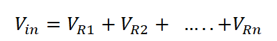
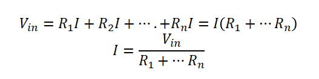
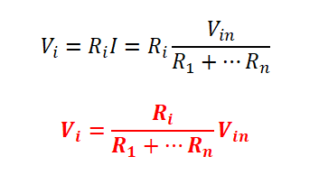
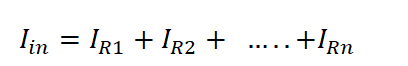
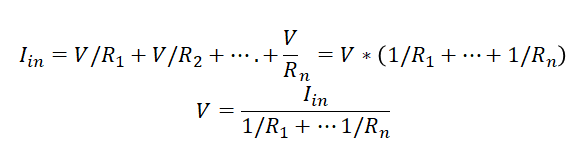
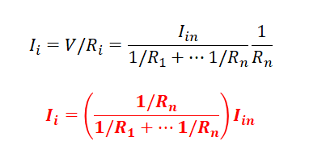
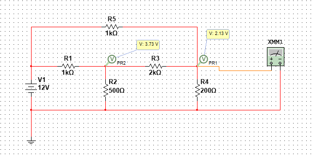
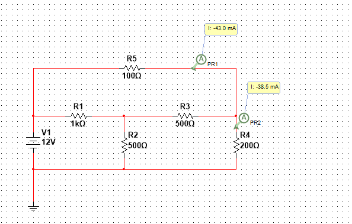

<b> Universidad Escuela Colombiana de Ingeniería Julio Garavito</b>
 

Henry Moreno Mosquera
 

Profesor del Centro de Estudios Electrónicos
 

henry.moreno@escuelaing.edu.co
 

# **CURSO DE ELECTRONICA BASICA PARA INGENIEROS. MODULO 1. CONCEPTOS DE CIRCUITOS RESISTIVOS**

## RESISTENCIAS

Se le denomina resistencia eléctrica a la oposición al flujo de corriente eléctrica a través de un conductor.

  

Los símbolos más utilizados son:

  

Las principales imágenes

  

### Resistencias Variables

#### Potenciometros

  

### Ley de OHM

La ley de Ohm, postulada por el físico y matemático alemán George Ohm, es una ley básica de los circuitos eléctricos. Establece que la diferencia de potencial V que aplicamos entre los extremos de un conductor determinado es proporcional a la intensidad de la corriente I que circula por el citado conductor. Ohm completó la ley introduciendo la noción de resistencia eléctrica  R que es el factor de proporcionalidad que aparece en la relación entre V e I

  

### Circuitos en Serie

Se llama circuito en serie a un tipo de circuito eléctrico provisto de un único camino para la corriente, que debe alcanzar a todos los bornes o terminales conectados en la red de manera sucesiva, es decir uno detrás de otro, conectando sus puntos de salida con el de entrada del siguiente.

Igualmente se dice que dos elementos están en serie, si en la unión de los bornes de dichos elementos no sale otro elemento. Es decir que el nodo de unión solo “une” a los dos elementos

  

### Divisores de Voltaje

En los circuitos en serie, se puede dividir el voltaje de entrada, de tal forma que a través de la salida por una resistencia podamos tener una porción del voltaje de entrada.
Las leyes de Kirchhoff determinan que el voltaje de entrada en un circuito en serie se distribuye a través de todos los elementos de la malla.

  

El voltaje en cada resistencia está dado por la resistencia multiplicado por la corriente.

Como la corriente es la misma, tenemos que:

  

Y el voltaje en una resistencia 𝑅_𝑖 está dado por:

  

### Circuitos en Paralelo

Cuando hablamos de un circuito en paralelo o una conexión en paralelo, nos referimos a una conexión de dispositivos eléctricos (como bobinas, generadores, resistencias, condensadores, etc.) colocados de manera tal que tanto los terminales de entrada o bornes de cada uno, como sus terminales de salida, coincidan entre sí.

  

### Divisores de Corriente

En los circuitos en paralelo, se puede dividir la corriente de entrada, de tal forma que a través de la salida por una resistencia podamos tener una porción del corriente de entrada.
Las leyes de Kirchhoff determinan que la corriente de entrada en un circuito en paralelo se distribuye a través de todos los elementos de la malla.

  

  

La corriente en cada resistencia está dado por el voltaje dividido por la respectiva resistencia.

El voltaje es el mismo, tenemos que:

  

Y la corriente en una resistencia 𝑅_𝑖 está dado por:

  

### Análisis de Circuitos por Mallas

El análisis de circuitos por mallas es una técnica utilizada en ingeniería eléctrica y electrónica para resolver circuitos complejos que contienen múltiples elementos, tales como resistencias, fuentes de voltaje y fuentes de corriente. La técnica de análisis de mallas se basa en la aplicación de las leyes de Kirchhoff, que son principios fundamentales para resolver circuitos eléctricos.

El método de análisis de mallas consiste en dividir el circuito en diferentes lazos o mallas, donde una malla es un camino cerrado en el circuito que no contiene ningún nodo interno (punto donde se conectan tres o más elementos). Luego, se asignan corrientes desconocidas a cada malla y se aplican las leyes de Kirchhoff para escribir ecuaciones que relacionen estas corrientes y las tensiones en los elementos del circuito.

Las dos leyes de Kirchhoff utilizadas en el análisis de mallas son:

La ley de corrientes de Kirchhoff (LCK): Esta ley establece que la suma algebraica de las corrientes en un nodo es igual a cero. En otras palabras, la suma de todas las corrientes que ingresan a un nodo es igual a la suma de todas las corrientes que salen de ese nodo.

La ley de tensiones de Kirchhoff (LTK): Esta ley establece que la suma algebraica de las caídas de voltaje en un lazo cerrado es igual a cero. En otras palabras, la suma de todas las caídas de voltaje a lo largo de un camino cerrado en el circuito es igual a la suma de las fuentes de voltaje en ese mismo camino cerrado.

Una vez que se han establecido las ecuaciones usando las leyes de Kirchhoff, se pueden resolver simultáneamente para encontrar los valores de las corrientes desconocidas en cada malla y, posteriormente, obtener otras variables como las tensiones en los elementos del circuito.

El análisis de mallas es especialmente útil para circuitos con muchas resistencias en serie y/o paralelo, ya que permite reducir el número de ecuaciones que deben resolverse en comparación con otros métodos de análisis de circuitos, como el análisis nodal. Sin embargo, el enfoque de mallas es más adecuado para circuitos donde el número de mallas es menor o igual al número de nodos menos uno (m <= N-1), donde N es el número de nodos en el circuito. Si el número de mallas es mayor, es posible que sea más práctico utilizar el análisis nodal o una combinación de ambos métodos para resolver el circuito.

Se identifican el número de mallas, de tal forma que queden involucrados todos los elementos del circuito. Para cada malla se relaciona una corriente
Para cada malla, se plantea una ecuación, de tal forma que los voltajes

## Taller de Evaluación

1. Implementar el siguiente circuito. Realizar el análisis teórico, para calcular los voltajes que se ilustran en la gráfica y corroborar que efectivamente corresponden a los datos medidos

  

   
2. Implementar el siguiente circuito. Realizar el análisis teórico, para calcular los voltajes que se ilustran en la gráfica y corroborar que efectivamente corresponden a los datos medidos

  

### Control de versiones

| Versión    | Descripción   | Autor                                      | Horas |
|------------|:--------------|--------------------------------------------|:-----:|
| 2023.07.31| Versión No. 1 | [Henry Moreno](https://github.com/hmorenom64)  |  6 |

_Curso Electronica Básica para Ingenieros es de uso libre para fines académicos.

_¡Encontraste útil este repositorio!, apoya su difusión marcando este repositorio con una ⭐ o síguenos dando clic en el botón Follow de [hmorenom64](https://github.com/hmorenom64?tab=repositories) en GitHub._

| [Anterior](tutorial_multisim.md)) | [:house: Inicio](../readme.md) | [:beginner: Ayuda / Colabora] | [Siguiente](tutorial_multisim.md) |
|----------------------------|-----------------------------------|--------------------------------------------------------------------------------------------------|-----------------------------------------|
                                                                                                                                      
                                                                                                                                

                                                                                                                                      
##

