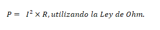
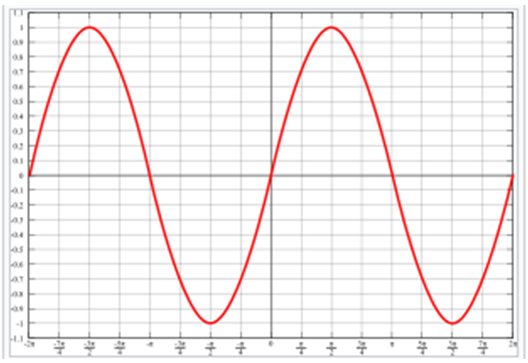
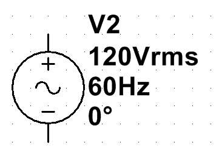
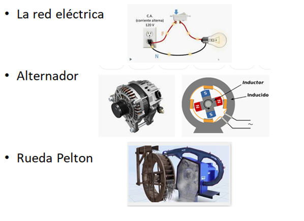
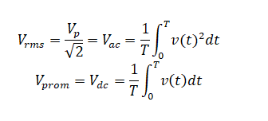
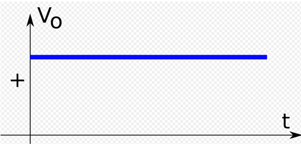
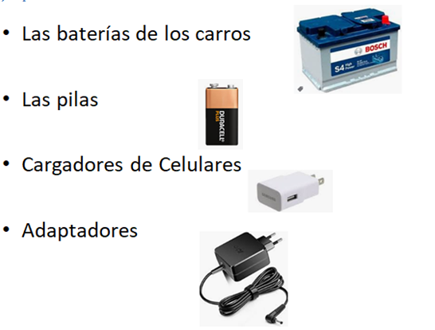
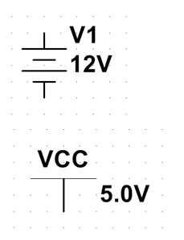
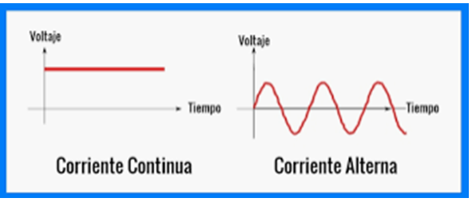

  

<b> Universidad Escuela Colombiana de Ingeniería Julio Garavito</b>
 

Henry Moreno Mosquera
 

Profesor del Centro de Estudios Electrónicos
 

henry.moreno@escuelaing.edu.co
 

# **CURSO DE ELECTRONICA BASICA PARA INGENIEROS. MODULO 1. CONCEPTOS BASICOS DE VOLTAJE, CORRIENTE Y POTENCIA**
 
## **Introducción.**

En este submodulo, el estudiante  revisará los conceptos fundamentales de la electricidad, con una descripción sencilla de las diferentes clases de voltajes y corriente.
## **Objetivos.**
Apropiarse de los diferentes conceptos, de la forma como se generan las diferentes señales de voltaje y sus principales usos en la vida cotidiana. Además, identificar las diferencias entre cada una de ellas.

## **Voltaje.**

El voltaje, también conocido como tensión eléctrica, es una medida de la diferencia de potencial eléctrico entre dos puntos en un circuito eléctrico. Se mide en voltios (V) y representa la fuerza con la que fluyen los electrones en un circuito. Un voltaje mayor significa que hay una mayor diferencia de potencial entre los puntos, lo que resulta en una mayor "presión" para que los electrones se desplacen a través del circuito. El voltaje es responsable de generar el flujo de corriente eléctrica en un circuito.

## **Corriente.**

La corriente eléctrica es el flujo de cargas eléctricas (normalmente electrones) a través de un conductor o un circuito. Se mide en amperios (A). La corriente eléctrica se produce cuando existe una diferencia de potencial (voltaje) entre dos puntos de un circuito, lo que impulsa a los electrones a moverse desde una región de potencial más alto (positivo) a una región de potencial más bajo (negativo). La intensidad de la corriente está directamente relacionada con la cantidad de carga que fluye por unidad de tiempo.

## **Potencia.**

La potencia eléctrica es la cantidad de energía eléctrica que se consume o suministra en un circuito por unidad de tiempo. Se mide en vatios (W). La potencia puede ser tanto positiva (cuando se suministra energía) como negativa (cuando se consume energía). En términos de voltaje y corriente, la potencia se calcula mediante la siguiente fórmula: 

P = V X I. 

También se puede expresar como 

  

En resumen, el voltaje es la diferencia de potencial eléctrico que impulsa la corriente a fluir a través de un circuito, mientras que la corriente es el flujo de cargas eléctricas. La potencia representa la cantidad de energía eléctrica transferida o consumida en un circuito y se calcula multiplicando el voltaje por la corriente. Estos conceptos son fundamentales para comprender el funcionamiento básico de los circuitos eléctricos y electrónicos.
# **CORRIENTE ALTERNA (AC) Y CORRIENTE CONTINUA (DC)**

AC (Corriente Alterna) y DC (Corriente Continua) son dos tipos de corriente eléctrica con características distintas:

## **Corriente Alterna (AC).**

La Corriente Alterna es una corriente eléctrica que cambia de dirección periódicamente en el tiempo. En un circuito de CA, el flujo de electrones se invierte continuamente, oscilando entre valores positivos y negativos en un ciclo repetitivo. La frecuencia de esta oscilación se mide en Hertz (Hz) y determina el número de ciclos completos que ocurren por segundo. La corriente alterna es la forma más común de suministro eléctrico en hogares y edificios, ya que es más fácil de generar, transmitir y distribuir a largas distancias.

  

Teniendo en cuenta que tradicionalmente la señal es sinusoidal, se tendrá una frecuencia, un periodo y una amplitud

Frecuencia  = 1 /Periodo

𝒇 = 𝟏/𝑻 

𝑽𝒑 es la máxima amplitud de la onda, o voltaje pico

Y la ecuación genérica para este caso es:

v(𝑡)=𝑉𝑝 𝑠𝑒𝑛𝑜(2𝜋𝑓𝑡)

### **Símbolo**

  

### **Ejemplos**

  

### **Aplicaciones**

Suministro eléctrico en hogares y edificios.

Transmisión de energía a largas distancias.

Uso en electrodomésticos, herramientas eléctricas y equipos industriales.

### **Relación RMS vs Vprom**

  

## **Corriente Continua (DC).**

La Corriente Continua es una corriente eléctrica que fluye en una sola dirección constante. En un circuito de CC, los electrones se mueven desde el polo negativo al polo positivo de una fuente de alimentación. Las baterías son un ejemplo común de fuentes de corriente continua, ya que proporcionan un flujo constante de electrones en una dirección específica.
##

  

### **Ejemplos Reales.**

  

### **Aplicaciones**

Alimentación de dispositivos electrónicos, como teléfonos móviles, computadoras y electrodomésticos portátiles.

Propulsión de vehículos eléctricos.

Suministro de energía a equipos electrónicos sensibles que requieren una fuente de alimentación estable.

Es importante comprender las diferencias entre AC y DC para utilizar el tipo de corriente adecuado según las necesidades específicas de cada aplicación.

### **Ventajas**

- Se puede almacenar el voltaje
- La mayoría de elementos electrónicos usa el voltaje DC para el funcionamiento
### **Desventajas**

- Dificultad para transmitir a largas distancias
- Siempre se consigue a partir del voltaje alterno

### **Símbolos**

  

## **Diferencias entre AC y DC.**

Su principal **diferencia** es que la **voltaje directo** tiene un polo negativo y un polo positivo, mientras que el **voltaje alterno**, va alterando la polaridad (de ahí su nombre) varias veces por segundo

  

### **Dirección del flujo de electrones.**

AC: Cambia de dirección periódicamente.

DC: Fluye en una sola dirección constante.

### **Generación y distribución.**

AC: Es más fácil de generar y se utiliza en la mayoría de las redes de suministro eléctrico para la transmisión a largas distancias.

DC: Generalmente se obtiene a partir de baterías y se utiliza en dispositivos electrónicos y sistemas de baja potencia.

## **Taller de Simulación.**
