

<b> Universidad Escuela Colombiana de Ingeniería Julio Garavito</b>
 

Henry Moreno Mosquera
 

Profesor del Centro de Estudios Electrónicos
 

henry.moreno@escuelaing.edu.co
 

# **CURSO DE ELECTRONICA BASICA PARA INGENIEROS. MODULO 1. DIODOS. TIPOS DE DIODOS Y APLICACIONES**

## Semiconductores

Son materiales que bajo ciertas condiciones eléctricas  pueden conducir (comportamiento de circuito cerrado) o no conducir (circuito abierto)

Los semiconductores son materiales que tienen una conductividad eléctrica entre la de los conductores (como metales) y la de los aislantes (como plásticos o cerámicas). Son esenciales en la fabricación de dispositivos electrónicos, como transistores, diodos, circuitos integrados y otros componentes fundamentales para la electrónica moderna.

En un semiconductor, la capacidad de conducir electricidad se puede controlar y modificar mediante la adición de impurezas o dopantes al material. Estos dopantes pueden aumentar o disminuir la cantidad de portadores de carga (electrones o huecos) en el semiconductor y, por lo tanto, cambiar su capacidad de conducción.

Los semiconductores están compuestos principalmente de elementos del grupo IV de la tabla periódica, como silicio (Si) y germanio (Ge). Sin embargo, otros elementos y compuestos, como el arseniuro de galio (GaAs) o el nitruro de galio (GaN), también se utilizan en aplicaciones más especializadas debido a sus propiedades específicas.

El desarrollo de la tecnología de semiconductores ha sido un pilar clave para la revolución digital y la informática moderna, permitiendo la miniaturización de componentes y el aumento exponencial del rendimiento de los dispositivos electrónicos a lo largo del tiempo (Ley de Moore).

Además de su uso en la electrónica, los semiconductores también son importantes en la generación y detección de luz en dispositivos como LED (diodos emisores de luz) y fotodetectores, y se emplean en aplicaciones de energía solar, donde ayudan a convertir la luz solar en electricidad mediante células fotovoltaicas.

El primer elemento creado bajo estas condiciones se le denominó DIODO

## Diodos

Un diodo es un componente electrónico fundamental que permite el flujo de corriente eléctrica en una dirección específica y bloquea su paso en la dirección opuesta. Funciona como una especie de válvula para la electricidad, permitiendo que la corriente fluya en una sola dirección.

Los diodos están construidos con materiales semiconductores, generalmente silicio o germanio. Hay diferentes tipos de diodos, cada uno con propiedades específicas para diferentes aplicaciones. Algunos de los tipos más comunes incluyen:

Diodo rectificador: Utilizado para convertir corriente alterna (AC) en corriente continua (DC). Es esencial en fuentes de alimentación y circuitos rectificadores.

Diodo emisor de luz (LED): Emite luz cuando la corriente fluye a través de él en la dirección correcta. Se usa ampliamente en indicadores, iluminación y pantallas.

Diodo zener: Diseñado para operar en inversa en un voltaje específico, manteniendo un voltaje constante a través de él. Se utiliza en reguladores de voltaje y protección contra sobretensiones.

Diodo Schottky: Tiene una caída de voltaje menor y un tiempo de conmutación más rápido en comparación con otros diodos. Se utiliza en aplicaciones de alta frecuencia y conmutación rápida.

Diodo túnel: Exhibe un fenómeno cuántico llamado "efecto túnel" que permite que la corriente fluya incluso cuando la tensión aplicada es menor que la barrera de energía.

Diodo varactor: Su capacidad de almacenar carga hace que sea útil en aplicaciones de sintonización y modulación de frecuencia.

La capacidad del diodo para permitir o bloquear el flujo de corriente se basa en su polarización. En la polarización directa, el diodo permite el flujo de corriente, mientras que en la polarización inversa, bloquea la corriente. Esta propiedad es esencial para su uso en muchos circuitos electrónicos y dispositivos.

### Diodo Polarizado directamente

Un diodo polarizado directamente es un tipo de configuración eléctrica en la que se aplica una tensión positiva en el ánodo y una tensión negativa en el cátodo de un diodo semiconductor. Esta polarización permite que el diodo conduzca la corriente eléctrica.

Cuando un diodo está polarizado directamente, la barrera de potencial creada por la unión PN del semiconductor se reduce, lo que facilita el flujo de corriente a través del diodo. En este estado, el diodo se comporta como un interruptor cerrado y permite que la corriente fluya libremente desde el ánodo hacia el cátodo.

Para polarizar un diodo directamente, la tensión aplicada debe ser mayor que la caída de tensión del diodo. En diodos de silicio típicos, esta caída de tensión suele ser de aproximadamente 0.7 voltios, mientras que en diodos de germanio es de aproximadamente 0.3 voltios.

Es importante tener en cuenta las características del diodo y las especificaciones del circuito al polarizar un diodo directamente para evitar dañar el componente o el circuito en general. Además, la polarización directa se utiliza en diversas aplicaciones, como en circuitos rectificadores y en la generación de señales en dispositivos electrónicos, como diodos emisores de luz (LED) y fotodiodos.

  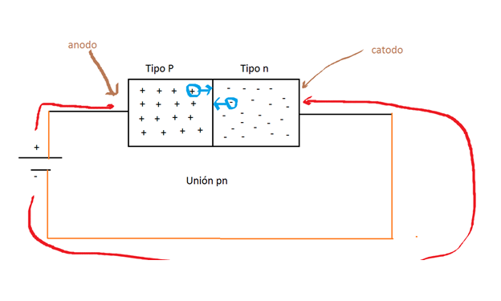

### Modelo real con resistencia

El circuito dediodo al conducir generaría un corto circuito sobre sus bornes, por lo cual es necesario ponerle una resistencia, tradicionalmente denominada carga o impedancia de carga

  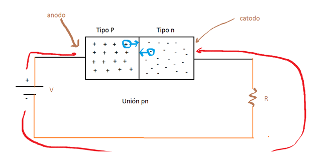

### Modelo real con Vd

Como el diodo al conducir mantiene un voltaje denominado Vd, cuyo valor depende del material con el que se construye, es importante tenerlo en cuenta en el modelo

  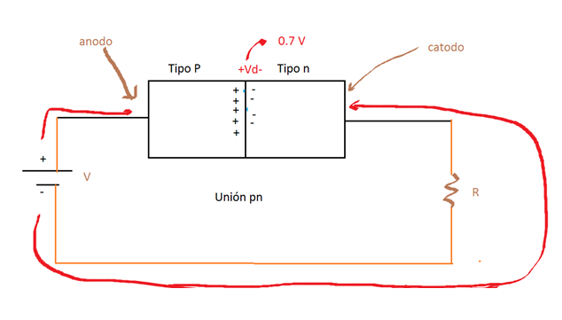

### Polarización inversa

La polarización inversa de un diodo ocurre cuando se aplica una tensión negativa en el terminal P (ánodo) y una tensión positiva en el terminal N (cátodo). En esta configuración, la corriente eléctrica fluye desde el cátodo hacia el ánodo, lo que normalmente no sucede en la operación normal del diodo.

Cuando se polariza inversamente un diodo, la región de unión PN se expande y se vuelve más ancha, lo que resulta en un aumento significativo en la resistencia. Como resultado, la corriente que fluye en esta dirección suele ser muy pequeña, incluso para tensiones aplicadas relativamente altas.

Este comportamiento se basa en las propiedades intrínsecas de la unión PN en el diodo. Cuando está polarizado inversamente, el diodo está en su estado de corte, lo que significa que bloquea eficientemente la corriente en esta configuración.

Es importante destacar que, aunque la corriente inversa es típicamente muy baja, algunos diodos están diseñados específicamente para trabajar en la región de ruptura inversa, donde se aprovecha este comportamiento y se utilizan como diodos Zener para aplicaciones de regulación de voltaje. En estos diodos, la región de ruptura está controlada y se especifica para permitir corrientes inversas controladas y estables a tensiones inversas específicas.

En resumen, la polarización inversa de un diodo se refiere a aplicar una tensión inversa en el dispositivo, lo que conduce a una corriente muy baja o casi nula en la mayoría de los diodos, excepto en diodos Zener específicos diseñados para trabajar en la región de ruptura inversa.

  
  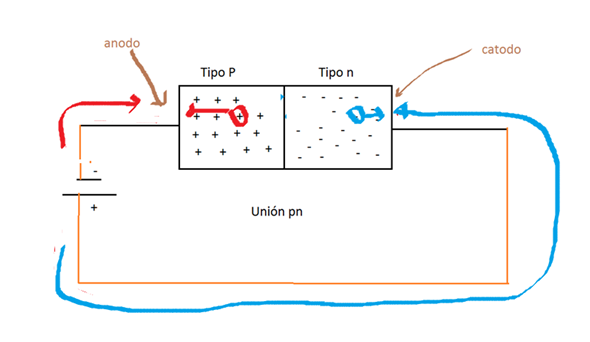

### Circuito Electrónico

El circuito electrónico se identifica en la siguiente figura:

  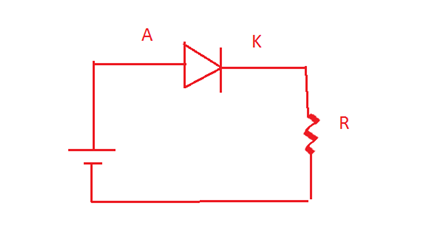

### Ideal

El modelo ideal es cuando no se contempla el voltaje de conduciión. Este caso se puede dar cuando el voltaje sobre la carga es much mayor a Vd.

  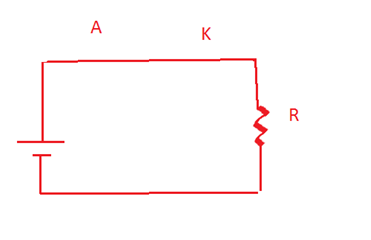

### Circuito final

El circuito final se ppresenta en la siguiente gráfica

  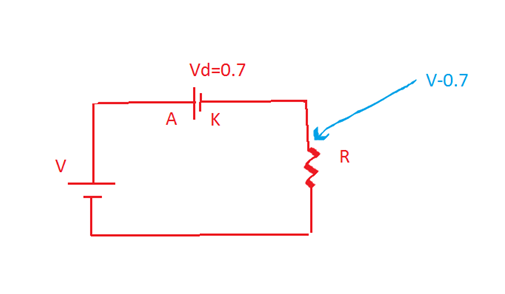

### Aplicación diodo - Adaptador DC 

  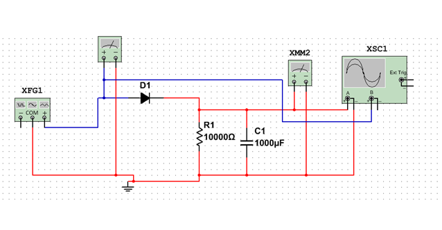

## Diodo Zener

Un diodo Zener es un tipo especial de diodo semiconductor diseñado para operar en la región de ruptura inversa o zona Zener. A diferencia de los diodos convencionales, que están diseñados para funcionar en la región de conducción directa, los diodos Zener están específicamente diseñados para operar en la región de ruptura inversa, lo que les permite mantener una tensión constante en sus terminales cuando se polarizan en esta dirección.

El comportamiento principal de un diodo Zener es su capacidad para mantener una tensión constante (voltaje Zener) a través de sus terminales, siempre que la corriente inversa (corriente en la dirección opuesta a la corriente de conducción) esté dentro de un rango específico conocido como corriente Zener nominal o corriente de prueba.

Esto hace que los diodos Zener sean muy útiles en diversas aplicaciones, principalmente en la regulación de tensión. Cuando se conecta en paralelo a una carga, el diodo Zener puede mantener una tensión estable en la carga, lo que lo convierte en un componente esencial en fuentes de alimentación reguladas y circuitos de protección contra sobretensiones.

En resumen, las principales características de un diodo Zener son:

Operación en la región de ruptura inversa.
Capacidad para mantener una tensión constante (voltaje Zener) en sus terminales dentro de un rango específico de corriente inversa.
Utilizado principalmente en aplicaciones de regulación de tensión y protección contra sobretensiones.
Es importante tener en cuenta las especificaciones del diodo Zener, como su voltaje Zener nominal, potencia máxima disipada y corriente de prueba, para utilizarlo correctamente en un circuito.

  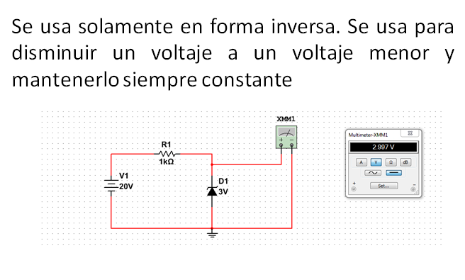

## Diodo LED

Un LED (Diodo Emisor de Luz). Cuando el conduce emite adicionalmente una luz

  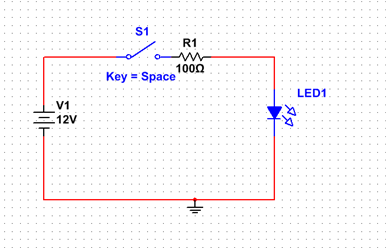

## Diodo SCR (Tiristor)

Es un diodo que cumple con la función de conducir cuando está polarizado en directo y abrirse cuando está polarizado en inverso. Es decir hasta ahí, es lo mismo que cualquier diodo.

  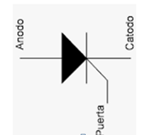

La diferencia entre un SCR y un diodo tradicional radica en la entrada adicional GATE (puerta), la cual es una entrada que se requiere para poder “dispararse” y conducir. Es decir, así esté polarizado en directo, pero si no hay orden de disparo el no conduce. Solamente hasta que le llegue un pulso de corriente el comienza a conducir.

Si está polarizado en inverso, así le llegue el pulso de corriente por el GATE, nunca conducirá

  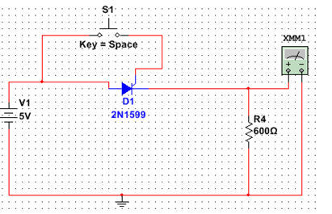

## Taller de Evaluación

1. Implementar el siguiente circuito y verificar la salida. Refleionar sobre la diferencia de la entrada y la salida

   

  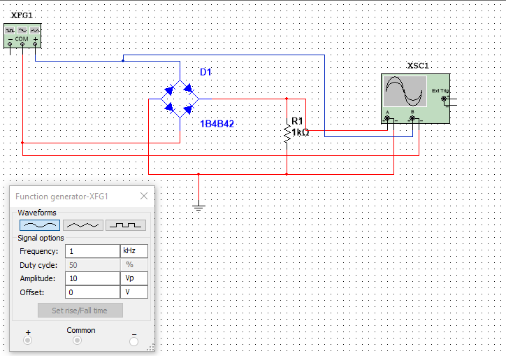

### Control de versiones

| Versión    | Descripción   | Autor                                      | Horas |
|------------|:--------------|--------------------------------------------|:-----:|
| 2023.07.31| Versión No. 1 | [Henry Moreno](https://github.com/hmorenom64)  |  6 |

_Curso Electronica Básica para Ingenieros es de uso libre para fines académicos.

_¡Encontraste útil este repositorio!, apoya su difusión marcando este repositorio con una ⭐ o síguenos dando clic en el botón Follow de [hmorenom64](https://github.com/hmorenom64?tab=repositories) en GitHub._

| [Anterior](circuitos_RLC.md) | [:house: Inicio](../readme.md) | [:beginner: Ayuda / Colabora] | [Siguiente](tutorial_multisim.md) |
|----------------------------|-----------------------------------|--------------------------------------------------------------------------------------------------|-----------------------------------------|
                                                                                                                                      
                                                                                                                                

                                                                                                                                      
##

