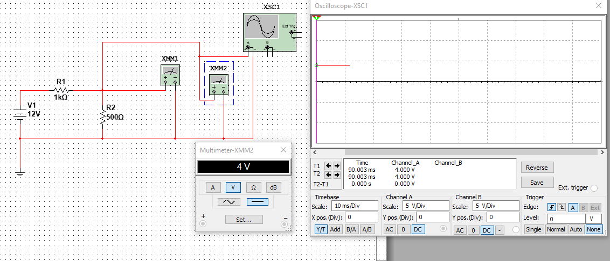

<b> Universidad Escuela Colombiana de Ingeniería Julio Garavito</b>
 

Henry Moreno Mosquera
 

Profesor del Centro de Estudios Electrónicos
 

henry.moreno@escuelaing.edu.co
 

# **CURSO DE ELECTRONICA BASICA PARA INGENIEROS. MODULO 1. MANUAL DE multiSIM**
 
## **Introducción.**

En este submodulo, el estudiante  tendrá el soporte necesario para el aprendizaje del simulador de National Instruments multiSIM.

## **Objetivos.**
Tener el soporte necesario para poder realizar las diferentes aplicaciones del curso mediante la plataforma de simulación multiSIM, el cal está desarrollado bajo National Insstruments.

## [Documento Tutorial de multiSIM](./manual_multiSIM.pdf)

## **Ejemplos Reales.**

1. Uso de Generador de voltaje DC y medidor con multimetro

  

   
2. Uso de Generador de voltaje AC y medidor con Osciloscopio

   

  

3. Uso de Generador de voltaje DC y dos resistencias y medidor de salida con Multimetro y Osciloscopio

  

## **Taller de Simulación.**

1. Primer ejercicio

   

  

   

  

2. Segundo ejercicio

   

  

   

  

3. Tercer ejercicio

   

  

   

  

## Control de versiones

| Versión    | Descripción   | Autor                                      | Horas |
|------------|:--------------|--------------------------------------------|:-----:|
| 2023.07.31| Versión No. 1 | [Henry Moreno](https://github.com/hmorenom64)  |  6 |

_Curso Electronica Básica para Ingenieros es de uso libre para fines académicos.

_¡Encontraste útil este repositorio!, apoya su difusión marcando este repositorio con una ⭐ o síguenos dando clic en el botón Follow de [hmorenom64](https://github.com/hmorenom64?tab=repositories) en GitHub._

| [Anterior](conceptos_basicos.md) | [:house: Inicio](../readme.md) | [:beginner: Ayuda / Colabora] | [Siguiente](Conceptos_redes_abiertas%20y%20redes_cerradas.md) |
|----------------------------|-----------------------------------|--------------------------------------------------------------------------------------------------|-----------------------------------------|
                                                                                                                                      
                                                                                                                                

                                                                                                                                      
##
