CI

<b> Universidad Escuela Colombiana de Ingeniería Julio Garavito</b>
 

Henry Moreno Mosquera
 

Profesor del Centro de Estudios Electrónicos
 

henry.moreno@escuelaing.edu.co
 

# **CURSO DE ELECTRONICA BASICA PARA INGENIEROS. MODULO 2. ALGEBRA BOOLEANA**

## FUNCIONES BASICAS

las funciones básicas de la Electrónica digital son:

AND
OR
NOT
XOR

### Compuerta  AND

La compuerta AND genera una salida a nivel ALTO sólo cuando todas las entradas están a nivel ALTO. Cuando cualquiera de la entradas está a nivel BAJO, la salida se pone a nivel BAJO. Por tanto, el propósito básico de una puerta AND es determinar cuándo ciertas condiciones de entrada son simultáneamente verdaderas, como indican todas sus entradas estando a nivel ALTO, y producir una salida a nivel ALTO, para indicar que esas condiciones son verdaderas. Las entradas de la puerta AND de dos entradas de la Figura se designan mediante A y B, y la salida con X, luego podemos establecer que el funcionamiento de la puerta es el siguiente:

En una puerta AND de dos entradas, la salida X es un nivel ALTO si A y B están a nivel ALTO; y X es un nivel BAJO si A es un nivel BAJO, o si B es un nivel BAJO, o si A y B están a nivel BAJO.

  

  

En Automatización, se describe a través de contactores:

  

Ahora bien, en la carpeta "soluciones_multisim" observaremos la implementación en Multisim, tanto con los interruptores, como con la función AND propia de los sistemas digitales.

### Compuerta OR

Una puerta OR genera un nivel ALTO a la salida cuando cualquiera de sus entradas está a nivel ALTO. La salida se pone a nivel BAJO sólo cuando todas las entradas están a nivel BAJO. Por tanto, el propósito de una puerta OR es determinar cuándo una o más de sus entradas están a nivel ALTO y generar una salida a nivel ALTO que indique esta condición. Las entradas de la puerta OR de dos entradas de la Figura están etiquetadas como A y B, y la salida como X. Podemos establecer el funcionamiento de la puerta como sigue:
En una puerta OR, la salida X es un nivel ALTO si cualquiera de las entradas, A o B, o ambas, están a nivel ALTO; X es un nivel BAJO si ambas entradas, A y B, están a nivel BAJO.

El nivel ALTO es el nivel de salida activo o verdadero para la puerta OR. La Figura ilustra la operación lógica para una puerta OR de dos entradas, indicando las cuatro posibles combinaciones de entrada.

La función lógica OR de dos variables se representa matemáticamente mediante un signo + entre las dos variables, por ejemplo, A + B. La suma en el álgebra de Boole implica variables cuyos valores son o el binario 1 o el binario 0. Las reglas básicas de la suma booleana son las siguientes:

  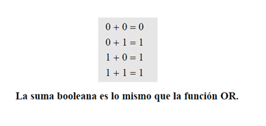

  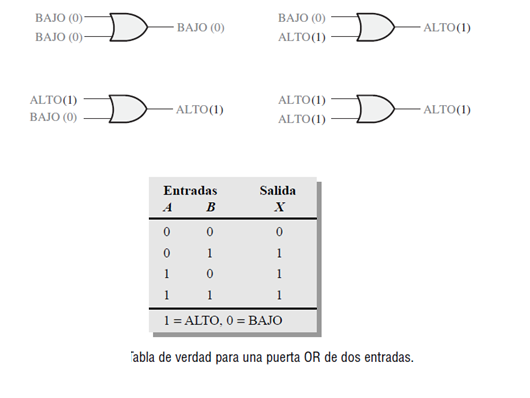

  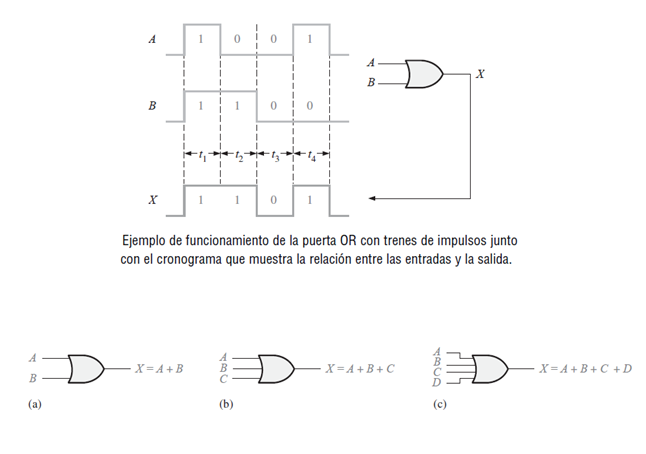

En Automatización, se describe a través de contactores:

  

Ahora bien, en la carpeta "soluciones_multisim" observaremos la implementación en Multisim, tanto con los interruptores, como con la función OR propia de los sistemas digitales.

### Compuerta XOR

La salida de una puerta OR−exclusiva se pone a nivel ALTO sólo cuando las dos entradas están a niveles lógicos opuestos. Esta operación se puede expresar, en función de dos entradas A y B y una salida X, del siguiente modo:
En una puerta OR−exclusiva, la salida X es un nivel ALTO si la entrada A está a nivel BAJO y la entrada B está a nivel ALTO; o si la entrada A está a nivel ALTO y la entrada B está a nivel BAJO; X es un nivel BAJO si tanto A como B están a nivel ALTO o BAJO.

  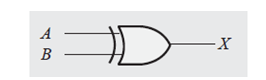

  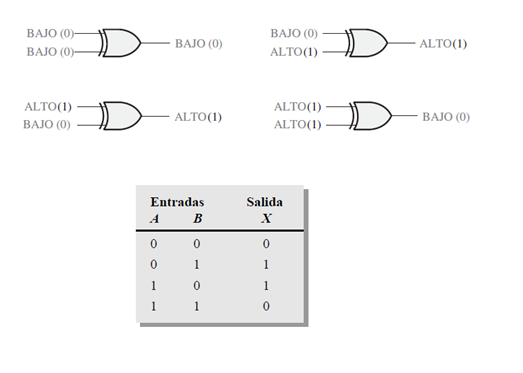

  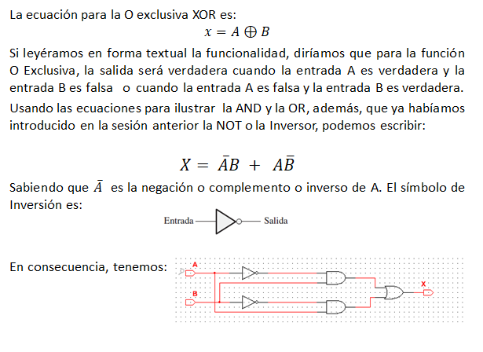

### Compuerta NAND

La puerta NAND genera una salida a nivel BAJO sólo cuando todas las entradas están a nivel ALTO. Cuando cualquiera de las entradas está a nivel BAJO, la salida se pondrá a nivel ALTO. Para el caso concreto de la puerta NAND de dos entradas, como la mostrada en la Figura, con la designación A y B para las entradas y X para la salida, el modo de operación se puede establecer como sigue:
En una puerta NAND de dos entradas, la salida X es un nivel BAJO si las entradas A y B están a nivel ALTO; X es un nivel ALTO si A o B están a nivel BAJO o si ambas, A y B, están a nivel BAJO.

  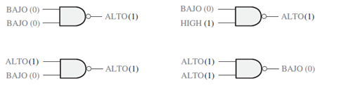

  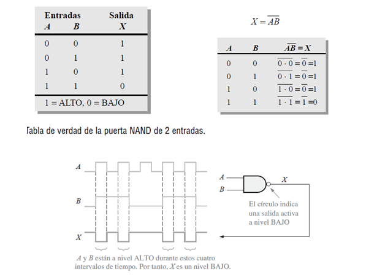

### Ejemplo

Una planta de fabricación utiliza dos tanques para almacenar un determinado líquido químico que se requiere en un proceso de fabricación. Cada tanque dispone de un sensor que detecta cuándo el nivel del líquido cae al 25% del total. Los sensores generan una tensión de 5 V cuando los tanques están llenos por encima del 25%. Cuando el volumen de líquido en el tanque cae por debajo del 25%, el sensor genera un nivel de 0 V.
En el panel indicador se requiere un diodo emisor de luz (LED, Light−Emitting Diode) verde que el tanque T1 o el T2 o ambos bajan del 25%.

Mientras que la salida de ambos sensores esté a nivel ALTO (5 V), quiere decir que el nivel de los tanques está por encima del 25% del volumen total, y la salida de la puerta NAND está a nivel BAJO (0 V). El circuito del LED verde se activa para una tensión a nivel BAJO.

  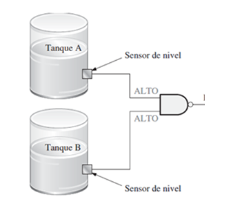

### Compuerta NOR

  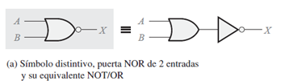

La puerta NOR genera una salida a nivel BAJO cuando cualquiera de sus entradas está a nivel ALTO. Sólo cuando todas sus entradas estén a nivel BAJO, la salida se pondrá a nivel ALTO. Para el caso concreto de la puerta NOR de dos entradas, que se muestra en la Figura, con la designación A y B para las entradas y X para la salida, el modo de operación se puede establecer como sigue:
En una puerta NOR de dos entradas: la salida X es un nivel BAJO si cualquiera de sus entradas A o B está a nivel ALTO, o si ambas entradas A y B están a nivel ALTO; X es un nivel ALTO si A y B están a nivel BAJO.

  

  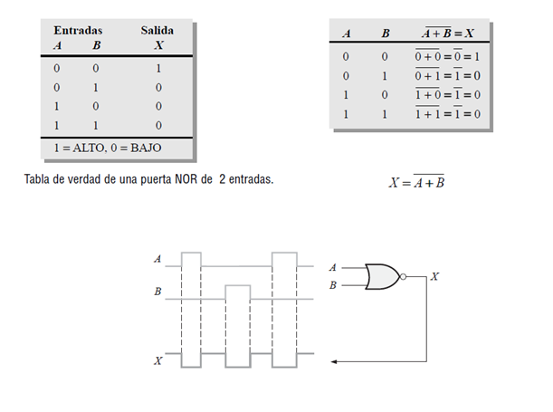

#### Ejemplo

Se tiene un sistema de procesamiento con dos maquinas en cascada (serie). Cada maquina muestra si está trabajando (variable =1), o disponible (variable =0). Para que entre un nuevo producto al sistema, deben estar las dos maquinas disponibles al mismo tiempo. El indicador entonces mostrará la disponibilidad.

  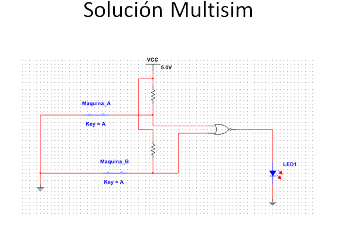

## Algebra Booleana

  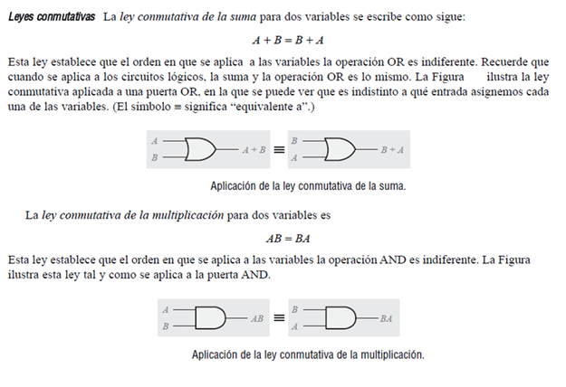

  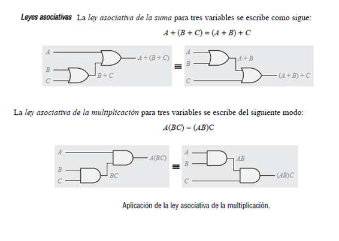

  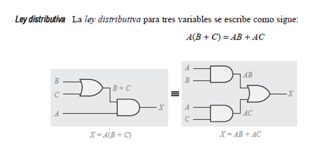

Reglas básicas

  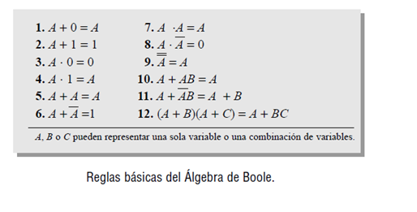

### Taller de Evaluacion

Diseñar e implementr en Multisim un circuito que permita sumar dos bits, generar el bit de salida y generar el arrastre hacia la siguiente etapa:

  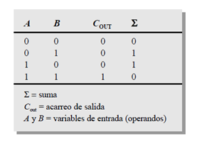

### Control de versiones

| Versión    | Descripción   | Autor                                      | Horas |
|------------|:--------------|--------------------------------------------|:-----:|
| 2023.07.31| Versión No. 1 | [Henry Moreno](https://github.com/hmorenom64)  |  3 |

_Curso Electronica Básica para Ingenieros es de uso libre para fines académicos.

_¡Encontraste útil este repositorio!, apoya su difusión marcando este repositorio con una ⭐ o síguenos dando clic en el botón Follow de [hmorenom64](https://github.com/hmorenom64?tab=repositories) en GitHub._

| [Anterior](numeracion_binaria.md) | [:house: Inicio](../readme.md) | [:beginner: Ayuda / Colabora] | [Siguiente](../readme.md) |
|----------------------------|-----------------------------------|--------------------------------------------------------------------------------------------------|-----------------------------------------|
                                                                                                                                      
                                                                                                                                

                                                                                                                                      
##

