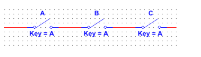

<b> Universidad Escuela Colombiana de Ingeniería Julio Garavito</b>
 

Henry Moreno Mosquera
 

Profesor del Centro de Estudios Electrónicos
 

henry.moreno@escuelaing.edu.co
 

# **CURSO DE ELECTRONICA BASICA PARA INGENIEROS. MODULO 2. ALGEBRA BOOLEANA**

## FUNCIONES BASICAS

las funciones básicas de la Electrónica digital son:

AND
OR
NOT
XOR

### Compuerta  AND

La compuerta AND genera una salida a nivel ALTO sólo cuando todas las entradas están a nivel ALTO. Cuando cualquiera de la entradas está a nivel BAJO, la salida se pone a nivel BAJO. Por tanto, el propósito básico de una puerta AND es determinar cuándo ciertas condiciones de entrada son simultáneamente verdaderas, como indican todas sus entradas estando a nivel ALTO, y producir una salida a nivel ALTO, para indicar que esas condiciones son verdaderas. Las entradas de la puerta AND de dos entradas de la Figura se designan mediante A y B, y la salida con X, luego podemos establecer que el funcionamiento de la puerta es el siguiente:

En una puerta AND de dos entradas, la salida X es un nivel ALTO si A y B están a nivel ALTO; y X es un nivel BAJO si A es un nivel BAJO, o si B es un nivel BAJO, o si A y B están a nivel BAJO.

  

  

En Automatización, se describe a través de contactores:

  

Ahora bien, observaremos la implementación en Multisim, tanto con los interruptores, como con la función AND propia de los sistemas digitales.

### Control de versiones

| Versión    | Descripción   | Autor                                      | Horas |
|------------|:--------------|--------------------------------------------|:-----:|
| 2023.07.31| Versión No. 1 | [Henry Moreno](https://github.com/hmorenom64)  |  3 |

_Curso Electronica Básica para Ingenieros es de uso libre para fines académicos.

_¡Encontraste útil este repositorio!, apoya su difusión marcando este repositorio con una ⭐ o síguenos dando clic en el botón Follow de [hmorenom64](https://github.com/hmorenom64?tab=repositories) en GitHub._

| [Anterior](../readme.md) | [:house: Inicio](../readme.md) | [:beginner: Ayuda / Colabora] | [Siguiente](../readme.md) |
|----------------------------|-----------------------------------|--------------------------------------------------------------------------------------------------|-----------------------------------------|
                                                                                                                                      
                                                                                                                                

                                                                                                                                      
##

