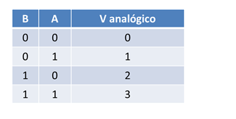
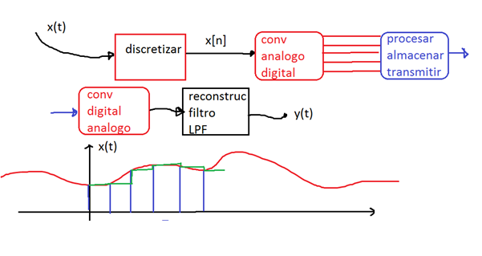
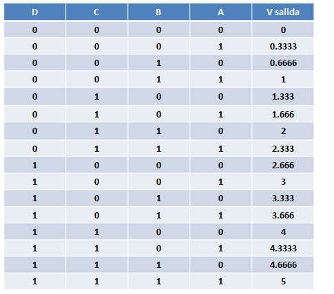
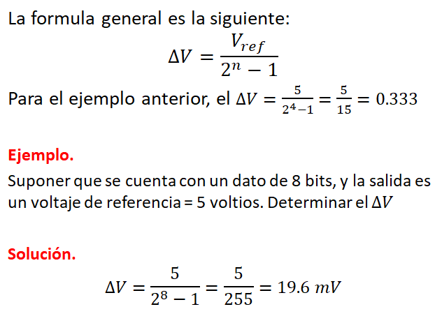
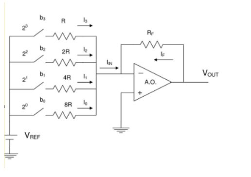
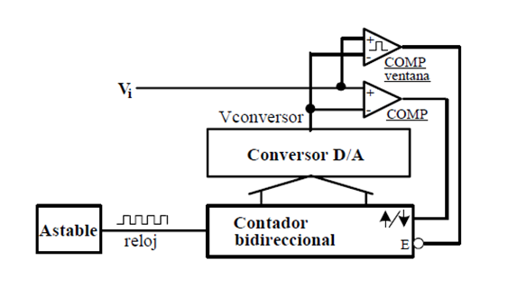
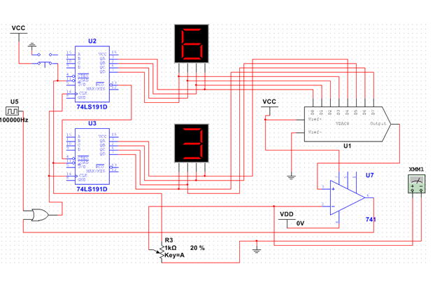

<b> Universidad Escuela Colombiana de Ingeniería Julio Garavito</b>
 

Henry Moreno Mosquera
 

Profesor del Centro de Estudios Electrónicos
 

henry.moreno@escuelaing.edu.co
 

# **CURSO DE ELECTRONICA BASICA PARA INGENIEROS. MODULO 2. CONVERORES A/D Y D/A**

## Conversión Digital / Análoga

Consiste en convertir un dato original que está en formato digital, para que a la salida se tenga un valor analógico (variable desde un Valor min hasta un Valor max

Por ejemplo, si tuviéramos dos datos de entrada en formato digital (0,1), mientras que el Valor min =0  y el Valor max= 3, tendríamos:

  

### Módelo típico de Procesamiento de señales

  

Para un sistema que tenga 4 datos de entrada, mientras que el umbral de salida estará entre 0 y 5 voltios, tenemos:

  

  

### Implementación Electrónica

  

## Conversión Análoga / Diggital

La conversión analógica-digital (ADC) es el proceso de convertir una señal analógica en una señal digital. Las señales analógicas son continuas en el tiempo y pueden tomar cualquier valor dentro de un rango específico, mientras que las señales digitales son discretas, tomando valores específicos en intervalos de tiempo regulares.

La conversión analógica-digital se lleva a cabo en muchos dispositivos electrónicos modernos, como computadoras, teléfonos inteligentes, cámaras digitales, sensores, etc. Estos dispositivos generalmente operan con señales digitales, pero la mayoría de las señales en el mundo real son analógicas (por ejemplo, sonido, temperatura, voltaje, etc.). Por lo tanto, es necesario convertir estas señales analógicas en digitales para que puedan ser procesadas, almacenadas o transmitidas electrónicamente.

El proceso de conversión analógica-digital se realiza en dos etapas principales:

Muestreo: En esta etapa, la señal analógica se muestrea en intervalos regulares de tiempo. Se toman muestras de la señal analógica a intervalos específicos, y el valor de la señal en cada punto de muestreo se mantiene para su posterior procesamiento.

Cuantización: Después del muestreo, los valores analógicos de las muestras se cuantifican para representarlos con valores digitales discretos. La cuantización implica asignar un valor digital específico a cada muestra, generalmente usando una escala discreta, como bits (por ejemplo, 8, 16 o 24 bits).

La calidad de la conversión analógica-digital depende de la tasa de muestreo y la resolución de cuantización utilizadas. Una tasa de muestreo más alta y una mayor resolución resultarán en una representación digital más precisa de la señal analógica original.

Es importante destacar que durante este proceso de conversión, siempre existe una pérdida de información, ya que la señal analógica original se representa con una cantidad finita de valores digitales discretos. Esto se conoce como ruido de cuantización, que es un error inherente en el proceso de conversión.

En resumen, la conversión analógica-digital es una parte esencial de la electrónica y la informática modernas, permitiendo la manipulación y el procesamiento eficiente de señales del mundo real mediante dispositivos digitales.

### Conversión ADC por Rampa

Se genera una rampa a través de un contador, el cual va seguido de un DAC. La salida del DAC será una rampa (realmente es una escalera, presentando el ruido granular conocido en telecomunicaciones). Dicha rampa se compara con la señal de entrada, y si llega a ser mayor, frena el proceso de conteo, siendo la salida del contador la señal de salida digital

  

El circuito implementado en Mutisim se observa a continuación:

  

### Control de versiones

| Versión    | Descripción   | Autor                                      | Horas |
|------------|:--------------|--------------------------------------------|:-----:|
| 2023.07.31| Versión No. 1 | [Henry Moreno](https://github.com/hmorenom64)  |  6 |

_Curso Electronica Básica para Ingenieros es de uso libre para fines académicos.

_¡Encontraste útil este repositorio!, apoya su difusión marcando este repositorio con una ⭐ o síguenos dando clic en el botón Follow de [hmorenom64](https://github.com/hmorenom64?tab=repositories) en GitHub._

| [Anterior](logica_secuencial.md)| [:house: Inicio](../readme.md) | [:beginner: Ayuda / Colabora] | [Siguiente](microcontrol.md) |
|----------------------------|-----------------------------------|--------------------------------------------------------------------------------------------------|-----------------------------------------|
                                                                                                                                      
                                                                                                                                

                                                                                                                                      
##
