

<b> Universidad Escuela Colombiana de Ingeniería Julio Garavito</b>
 

Henry Moreno Mosquera
 

Profesor del Centro de Estudios Electrónicos
 

henry.moreno@escuelaing.edu.co
 

# **CURSO DE ELECTRONICA BASICA PARA INGENIEROS. MODULO 2. LOGICA COMBINACIONAL**

## Sumadores

Los sumadores son los circuitos básicos que se implementan en la lógica diigital, con lo cuaal se pueden generar cualquiera de las funciones
matemáticas. 
Para su implemnetación es importante entender el concepto del funcionamiento algoritmico de la suma

### Sumador de un bit Completo (Full Adder)

Para hacer una suma de datos de n bits, lo más práctico es hacer un sistema que me sume dos bits, me genere una salida y un acarreo al siguiente bit de la izquierda. En ese caso, el de la izquierda, tendrá que sumar sus dos bits y el que viene de la derecha. En términos generales, se deberá generar un sistema de tres entradas, X Y 𝐶_𝑖𝑛 y dos salidas 𝐹 𝑦 𝐶_𝑜𝑢𝑡. La tabla de verdad será

  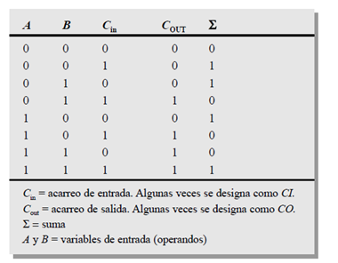

Las tablas de verdad

  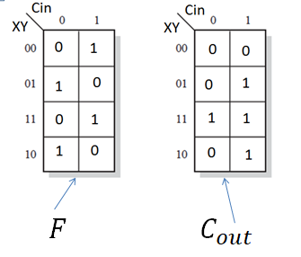

Las ecuaciones son:

𝐹=𝐗⨁𝒀⨁𝑪_𝒊𝒏

𝑪_𝒐𝒖𝒕=𝑿𝒀+𝑪_𝒊𝒏 (𝑿+𝒀)

### Sumador de 4 bits

El circuito sumador de 4 bits, corresponde a 4 sumadores de 1 bit, encadenados en forma serial, permitiendo aplicar el mismo concepto algorítmico
de la forma como tradicionalmente se desarrolla la suma

  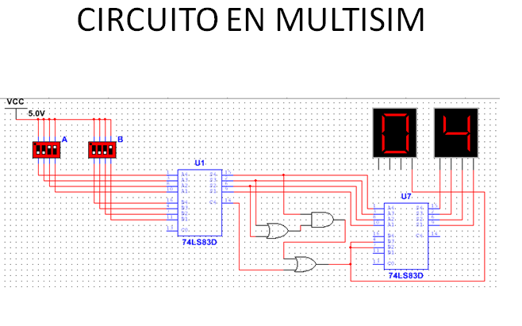

 

En la imagen se observa su implementación, en donde se está sumando dos datos: 0101  (equivale a 5)  y 0110 (equivale a 6). El resultado es 1011 (equivale a 11)

## Comparadores

Para hacer comparación entre dos datos, se hace el algoritmo de comparación del bit mas significativo hacía el bit menos significativo.
Pensemos dos datos DCBA y XYZW.

  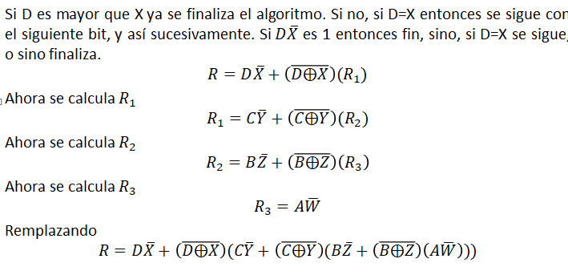

El siguiente circuito detecta si es mayor

  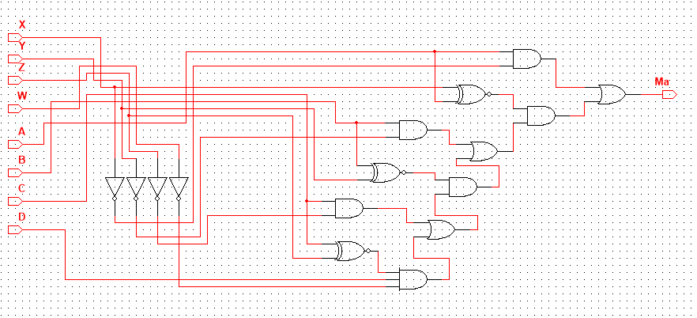

El siguiente circuito detecta si son iguales

  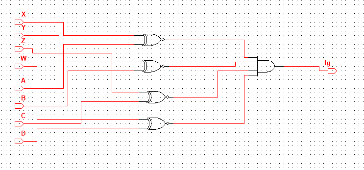

Y la integración, nos permite visualizar si es mayor, igual o menor

  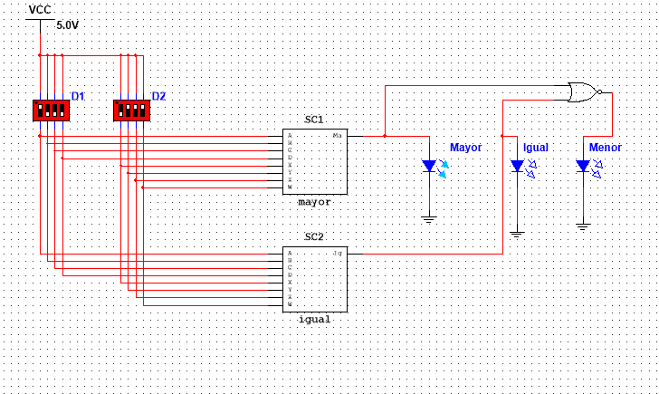

En este caso en particular está comparando al número 1000 (8) y al número 0111 (7). El sesultado es mayor

## Decodificadores

La función básica de un decodificador es detectar la presencia de una determinada combinación de bits (código) en sus entradas y señalar la presencia de este código mediante un cierto nivel de salida. En su forma general, un decodificador posee n líneas de entrada para gestionar n bits y en una de las 2^𝑛  líneas de salida indica la presencia de una o más combinaciones de n bits. 

### Ejemplo 1

Detectar cuando una entrada de 2 bits AB, tiene la combinación 00, 01, 10 o 11

  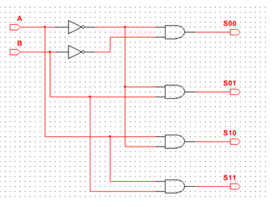

### Ejemplo 2

Un decodificador de 4 entradas, debe tener 16 salidas, donde c/u de ellas es mutuamente excluyente (solo una se activa a la vez)

  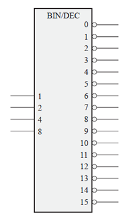

Podemos observar que las salidas son negadas.

### Ejemplo 3

Un decodificador de BCD a decimal. Solamente se activará una salida a la vez, dependiendo de la combinación de entrada

  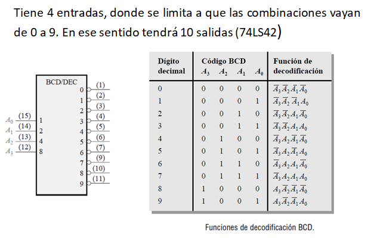

### Ejemplo 4

Un decodificador BCD a 7 segementos

  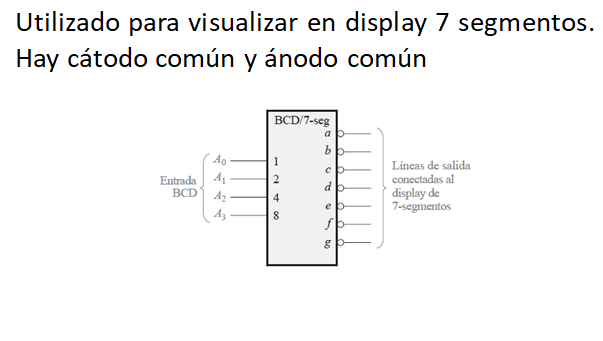

## Codificadores

Un codificador es un circuito lógico combinacional que, esencialmente, realiza la función “inversa” del decodificador. Un codificador permite que se introduzca en una de sus entradas un nivel activo que representa un dígito, como puede ser un dígito decimal u octal, y lo convierte en una salida codificada, como BCD o binario. Los codificadores se pueden diseñar también para codificar símbolos diversos y caracteres alfabéticos. El proceso de conversión de símbolos comunes o números a un formato codificado recibe el nombre de codificación.

### Ejemplo 5

Un codificador decimal - BCD. 10 Entradas, mutuamente excluyentes, y 4 salidas. Las cuales identificarán cual entrada está activa (74LS147)

  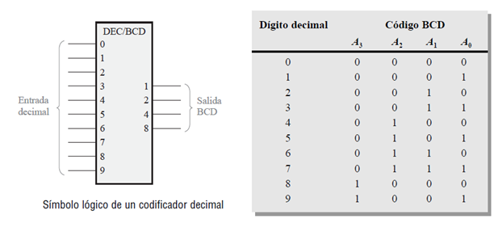

### Ejemplo 6

Un codificador de 8 entradas y tres salidas

Tiene 8 entradas de 0 a 7, y tres salidas (74LS148)

  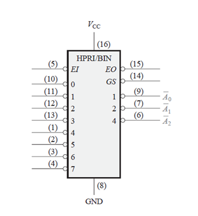

### Ejemplo 7

Un codificador 16 x 4, configurado a través de dos codificadores de 8 x 3

  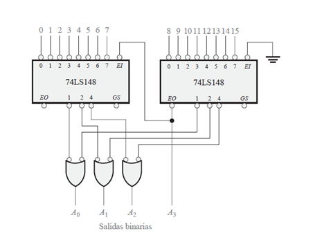

## Multiplexores (MUX)

Un multiplexor (MUX) es un dispositivo que permite dirigir la información digital procedente de diversas fuentes a una única línea para ser transmitida a través de dicha línea a un destino común. El multiplexor básico posee varias líneas de entrada de datos y una única línea de salida. También posee entradas de selección de datos, que permiten conmutar los datos digitales provenientes de cualquier entrada hacia la línea de salida. A los multiplexores también se les conoce como selectores de datos.

  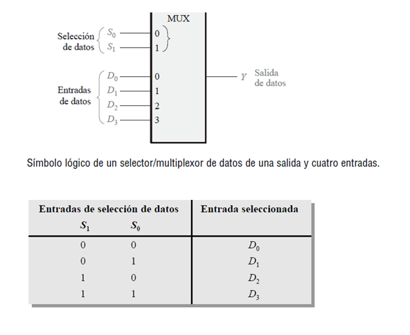

  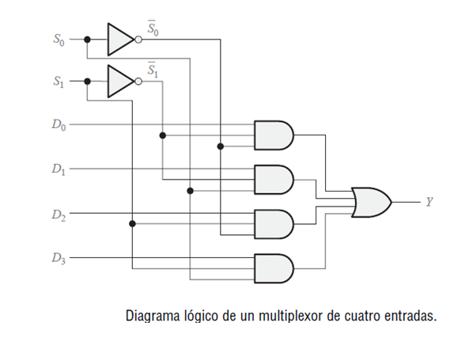

Uno de los circuitos integrados mas comunes para implementar un MUX cuadruple 2x1

  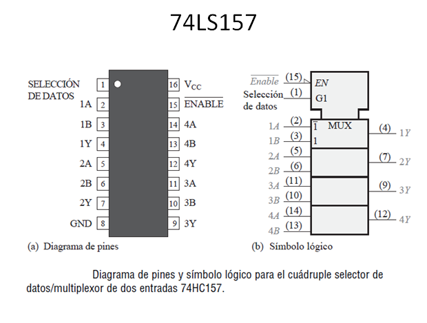

Podemos tener un MUX 8x1, como el del siguiente circuito:

  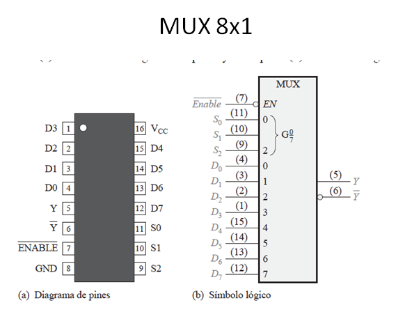

Igualmente podemos tener un MUX 16x1, como el del siguiente circuito:

  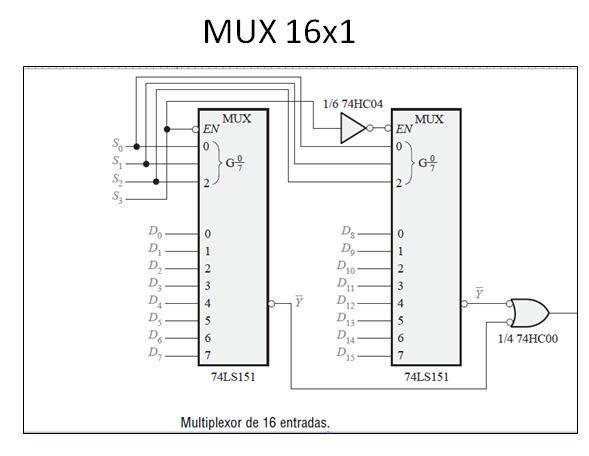

## Taller de Evaluación

1. Diseñar un sistema que me sume entradas binarias (0000 hasta 1111), y a la salida me de BCD (decimal). Es decir, si la entrada fuera 1111 + 1111 debe dar 30

2. Desarrollar un sistema que tenga 8 entradas y 4 salidas. Las salidas me mostrarán la cantidad de 1’s que hay en la entrada

3. Implementar un circuito que detecte si un número es diferente a otro.

4. Implementar un decodificador de 5 x 32, usando decodificadores de 3 x 8

5. Implementar un codificador de 32 x 5 utilizando codificadores de 8 x 3

6. Se tienen tres interruptores ABC que me identifican la presencia de monedas de $10, $7, y $5 respectivamente. De la misma forma hay dos interruptores DE que me representan la solicitud de dos productos de $11 y $ 8 respectivamente. Tanto ABC como DE pueden activarse simultáneamente.
Las salidas serán por un lado un display que me identifica 0 si no entrega producto, 1 si entrega el producto 1, 2 si entrega el producto 2 y 3 si entrega al tiempo los dos productos.
Otros 3 displays me mostrarán las “vueltas” si se pudo entregar con un signo + en el primer display, o me mostrará lo que faltó de dinero para entregar con un signo – en el primer display.

### Control de versiones

| Versión    | Descripción   | Autor                                      | Horas |
|------------|:--------------|--------------------------------------------|:-----:|
| 2023.07.31| Versión No. 1 | [Henry Moreno](https://github.com/hmorenom64)  |  6 |

_Curso Electronica Básica para Ingenieros es de uso libre para fines académicos.

_¡Encontraste útil este repositorio!, apoya su difusión marcando este repositorio con una ⭐ o síguenos dando clic en el botón Follow de [hmorenom64](https://github.com/hmorenom64?tab=repositories) en GitHub._

| [Anterior](algebra_booleana.md)| [:house: Inicio](../readme.md) | [:beginner: Ayuda / Colabora] | [Siguiente](../readme.md) |
|----------------------------|-----------------------------------|--------------------------------------------------------------------------------------------------|-----------------------------------------|
                                                                                                                                      
                                                                                                                                

                                                                                                                                      
##
