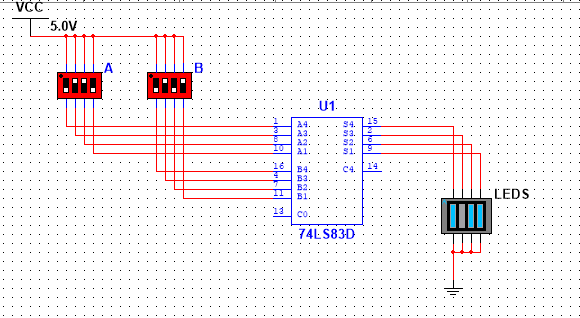

<b> Universidad Escuela Colombiana de Ingeniería Julio Garavito</b>
 

Henry Moreno Mosquera
 

Profesor del Centro de Estudios Electrónicos
 

henry.moreno@escuelaing.edu.co
 

# **CURSO DE ELECTRONICA BASICA PARA INGENIEROS. MODULO 2. LOGICA COMBINACIONAL**

## Sumadores

Los sumadores son los circuitos básicos que se implementan en la lógica diigital, con lo cuaal se pueden generar cualquiera de las funciones
matemáticas. 
Para su implemnetación es importante entender el concepto del funcionamiento algoritmico de la suma

### Sumador de un bit Completo (Full Adder)

Para hacer una suma de datos de n bits, lo más práctico es hacer un sistema que me sume dos bits, me genere una salida y un acarreo al siguiente bit de la izquierda. En ese caso, el de la izquierda, tendrá que sumar sus dos bits y el que viene de la derecha. En términos generales, se deberá generar un sistema de tres entradas, X Y 𝐶_𝑖𝑛 y dos salidas 𝐹 𝑦 𝐶_𝑜𝑢𝑡. La tabla de verdad será

  

Las tablas de verdad

  

Las ecuaciones son:

𝐹=𝐗⨁𝒀⨁𝑪_𝒊𝒏

𝑪_𝒐𝒖𝒕=𝑿𝒀+𝑪_𝒊𝒏 (𝑿+𝒀)

### Sumador de 4 bits

El circuito sumador de 4 bits, corresponde a 4 sumadores de 1 bit, encadenados en forma serial, permitiendo aplicar el mismo concepto algorítmico
de la forma como tradicionalmente se desarrolla la suma

  

 

En la imagen se observa su implementación, en donde se está sumando dos datos: 0101  (equivale a 5)  y 0110 (equivale a 6). El resultado es 1011 (equivale a 11)

## Comparadores

Para hacer comparación entre dos datos, se hace el algoritmo de comparación del bit mas significativo hacía el bit menos significativo.
Pensemos dos datos DCBA y XYZW.

  

El siguiente circuito detecta si es mayor

  

El siguiente circuito detecta si son iguales

  

Y la integración, nos permite visualizar si es mayor, igual o menor

  

En este caso en particular está comparando al número 1000 (8) y al número 0111 (7). El sesultado es mayor
## Taller de Evaluación

1. Diseñar un sistema que me sume entradas binarias (0000 hasta 1111), y a la salida me de BCD (decimal). Es decir, si la entrada fuera 1111 + 1111 debe dar 30

2. Desarrollar un sistema que tenga 8 entradas y 4 salidas. Las salidas me mostrarán la cantidad de 1’s que hay en la entrada

### Control de versiones

| Versión    | Descripción   | Autor                                      | Horas |
|------------|:--------------|--------------------------------------------|:-----:|
| 2023.07.31| Versión No. 1 | [Henry Moreno](https://github.com/hmorenom64)  |  3 |

_Curso Electronica Básica para Ingenieros es de uso libre para fines académicos.

_¡Encontraste útil este repositorio!, apoya su difusión marcando este repositorio con una ⭐ o síguenos dando clic en el botón Follow de [hmorenom64](https://github.com/hmorenom64?tab=repositories) en GitHub._

| [Anterior](algebra_booleana.md)| [:house: Inicio](../readme.md) | [:beginner: Ayuda / Colabora] | [Siguiente](../readme.md) |
|----------------------------|-----------------------------------|--------------------------------------------------------------------------------------------------|-----------------------------------------|
                                                                                                                                      
                                                                                                                                

                                                                                                                                      
##
