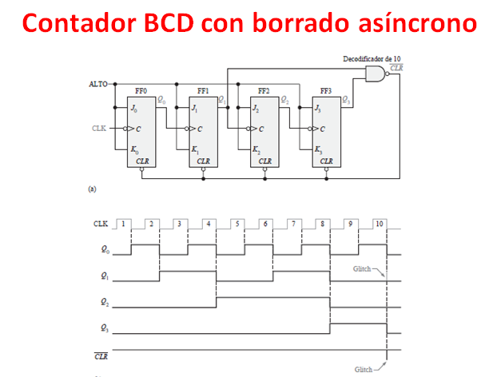
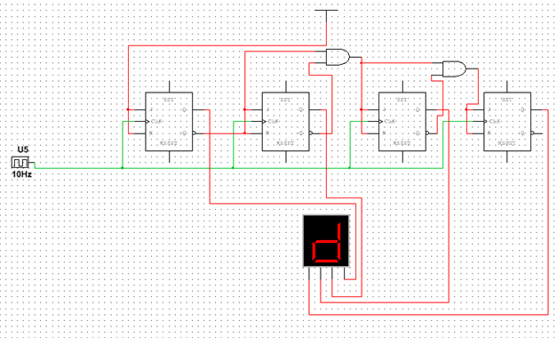
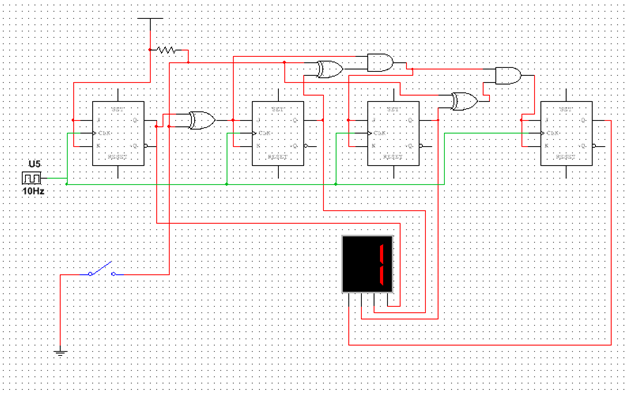
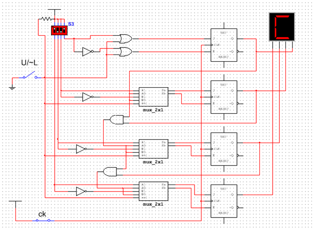
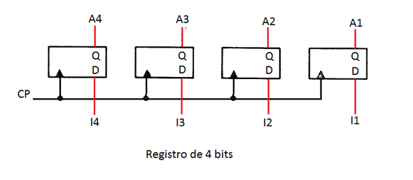
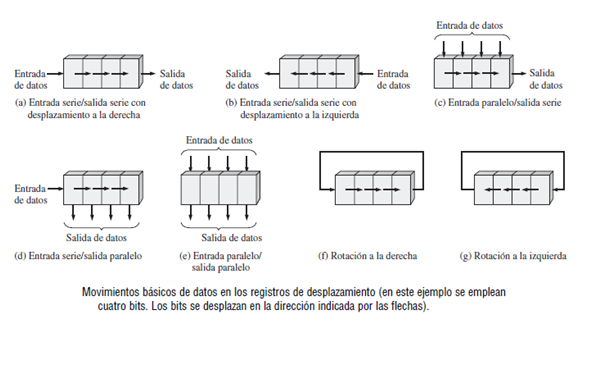
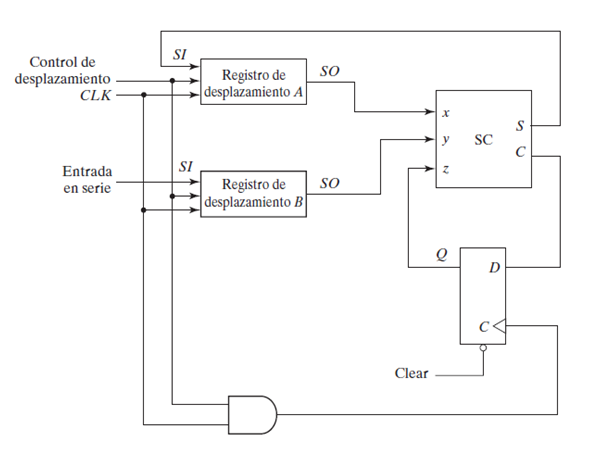

<b> Universidad Escuela Colombiana de Ingeniería Julio Garavito</b>
 

Henry Moreno Mosquera
 

Profesor del Centro de Estudios Electrónicos
 

henry.moreno@escuelaing.edu.co
 

# **CURSO DE ELECTRONICA BASICA PARA INGENIEROS. MODULO 2. LOGICA SECUENCIAL**

## Introducción.

La lógica secuencial es un área de la electrónica digital y la lógica computacional que se ocupa del diseño y análisis de sistemas o circuitos que operan en secuencia, es decir, toman en cuenta eventos y condiciones pasados para determinar su comportamiento futuro. En contraste, la lógica combinacional solo depende de las entradas actuales y produce salidas independientes de los estados anteriores.

Los sistemas secuenciales son ampliamente utilizados en dispositivos electrónicos, computadoras, controladores, microprocesadores y otros circuitos digitales que necesitan mantener estados y recordar información. La lógica secuencial utiliza elementos de memoria, como biestables o flip-flops, para almacenar bits de información y tener en cuenta el historial de estados.

Los principales componentes de la lógica secuencial son:

Biestables (Flip-flops): Son dispositivos de almacenamiento que tienen dos estados estables (0 y 1). Estos biestables pueden ser del tipo D, JK, SR, T, entre otros. Se utilizan para mantener estados y almacenar información.

Temporizadores y contadores: Son circuitos secuenciales que se utilizan para medir el tiempo o contar eventos. Los temporizadores generan señales de reloj con una frecuencia determinada, mientras que los contadores cuentan la cantidad de pulsos de entrada.

Registros de desplazamiento: Son circuitos que permiten mover los bits de una entrada a lo largo de una cadena de biestables. Se utilizan para tareas como desplazamiento de datos o implementación de registros de almacenamiento de datos.

Máquinas de estados: Son sistemas secuenciales que cambian de estado en respuesta a entradas específicas y producen salidas según el estado actual. Las máquinas de estados se utilizan ampliamente en el diseño de controladores y protocolos de comunicación.

La lógica secuencial se implementa utilizando circuitos lógicos, como compuertas lógicas y multiplexores, combinados con elementos de memoria para mantener estados. El comportamiento de los circuitos secuenciales se puede describir mediante diagramas de tiempo, tablas de transición y diagramas de estados.

Es importante tener en cuenta que el diseño y análisis de sistemas secuenciales pueden ser complejos debido a la posibilidad de generar comportamientos no deseados, como carreras o conflictos. Por lo tanto, los diseñadores deben aplicar técnicas y metodologías para garantizar el correcto funcionamiento de los circuitos secuenciales.

## Contadores

### Contadores Asíncronos (o de rizo). 

Son aquellos donde el pulso de reloj no le llega al mismo tiempo a todos los Flip_Flop, sino que cada reloj depende de las salidas de los bits vecinos a su derecha (LSB).

###Contadores Síncronos. 

Son aquellos donde el pulso de reloj les llega al mismo tiempo a todos los Flip_Flop, sin embargo, las entradas van variando de acuerdo al estado, haciendo que en unos casos hagan una tarea y en otros casos realice otra tarea

  

  

### Contadores Síncronos.

El término síncrono se refiere a los eventos que tienen una relación temporal fija entre sí. Un contador síncrono es aquel en el que todos los flip-flops del contador reciben en el mismo instante la señal de reloj.

  

Eldiarama implementado sería:

  

### Contador sincrono acendente/descendente

Se debe tener un interruptor que seleccione si para cada bit se toma la salida del flip_flop normal o negada. Puede ser un MUX 2x1 o en su defecto una compuerta XOR con la salida de cada bit

  

### Contador Binario con carga en Paralelo

Deberá tener la opción de Cargar un dato externo o Conteo. Asumimos que solo tenga cuenta ascendente. Un bit 𝑈/𝐿 ̅, me indica que cuando está en 1, cuenta ascendente y cuando está en 0, cargará el valor externo.
En ambos casos, deberá recibir el valor de la carga mediante un pulso de reloj

  

## Registros de Almacenamiento

La idea principal de esta aplicación es el almacenamiento de datos en forma ordenada. 
Ya observamos, mediante el uso del flip_flop tipo D, como es la forma de almacenar un bit.
En este capítulo observaremos la forma de almacenar n bits, y las diferentes formas de realizarlo, principalmente pensando en el tiempo de ejecución, en los medios de transmisión y en HW utilizado

### Registros con carga en Paralelo

Es el dispositivo que tiene  n entradas, una para cada bit de almacenamiento y n salidas, uno para cada bit almacenado. Se denomina de carga en paralelo, ya que con un solo pulso de reloj se almacenan al mismo tiempo todos los bits

  

### Registros de Desplazamiento

Los registros de desplazamiento (también conocidos como shift registers en inglés) son circuitos digitales utilizados para almacenar y mover datos de una posición a otra dentro del registro. Estos registros son especialmente útiles en aplicaciones donde se necesita almacenar temporalmente datos serialmente y/o realizar operaciones de desplazamiento.

Hay varios tipos de registros de desplazamiento, pero los dos más comunes son:

Registro de desplazamiento a izquierda (Left Shift Register): En este tipo de registro, los bits se desplazan hacia la izquierda (de posición más significativa a posición menos significativa). Al desplazarse, el bit que se encuentra en el extremo izquierdo se descarta, y en el extremo derecho, se ingresa un nuevo bit (que generalmente es un bit de entrada). Esto puede ser útil para multiplicar un número binario por una potencia de 2, ya que cada desplazamiento hacia la izquierda es equivalente a multiplicar el número por 2.

Registro de desplazamiento a derecha (Right Shift Register): En este tipo de registro, los bits se desplazan hacia la derecha (de posición menos significativa a posición más significativa). Al desplazarse, el bit que se encuentra en el extremo derecho se descarta, y en el extremo izquierdo, se ingresa un nuevo bit (generalmente se duplica el bit más significativo o se usa un bit de entrada). Esto puede ser útil para dividir un número binario por una potencia de 2, ya que cada desplazamiento hacia la derecha es equivalente a dividir el número por 2.

Los registros de desplazamiento pueden tener diferentes configuraciones, como:

Registro de desplazamiento de desplazamiento simple (Single Shift Register): Donde los datos se desplazan en una dirección (izquierda o derecha) en función de la operación requerida.

Registro de desplazamiento de desplazamiento circular (Circular Shift Register): En este tipo de registro, los bits se desplazan de manera circular, es decir, el bit que sale por un extremo entra nuevamente por el otro extremo. Esto puede ser útil en aplicaciones donde se necesita rotar los datos.

Estos registros son ampliamente utilizados en diversas aplicaciones, como comunicaciones seriales, procesamiento de señales digitales, generación de secuencias pseudoaleatorias y muchas otras áreas en las que se requiere manipular datos de forma secuencial y temporal.

  

## Taller de Evaluación

Implementar el sumador serie. Las operaciones de las computadoras digitales por lo regular se efectúan en paralelo porque este modo de operación es más rápido. Las operaciones en serie son más lentas, pero tienen la ventaja de requerir menos equipo. Para ilustrar el modo de operación en serie, presentaremos aquí el diseño de un sumador en serie. 
Los dos números binarios que se sumarán en serie se almacenan en dos registros de desplazamiento.
Los bits se suman par por par utilizando un solo circuito de sumador completo (SC).
El acarreo de salida del sumador completo se transfiere a un flip-flop D. La salida de este flip-flop se utiliza entonces como acarreo de entrada para el siguiente par de bits significativos. El bit de suma de la salida S del sumador completo podría transferirse a un tercer registro de desplazamiento.

  

### Control de versiones

| Versión    | Descripción   | Autor                                      | Horas |
|------------|:--------------|--------------------------------------------|:-----:|
| 2023.07.31| Versión No. 1 | [Henry Moreno](https://github.com/hmorenom64)  |  6 |

_Curso Electronica Básica para Ingenieros es de uso libre para fines académicos.

_¡Encontraste útil este repositorio!, apoya su difusión marcando este repositorio con una ⭐ o síguenos dando clic en el botón Follow de [hmorenom64](https://github.com/hmorenom64?tab=repositories) en GitHub._

| [Anterior](logica_combinacional.md)| [:house: Inicio](../readme.md) | [:beginner: Ayuda / Colabora] | [Siguiente](conversor_AD_DA.md) |
|----------------------------|-----------------------------------|--------------------------------------------------------------------------------------------------|-----------------------------------------|
                                                                                                                                      
                                                                                                                                

                                                                                                                                      
##
