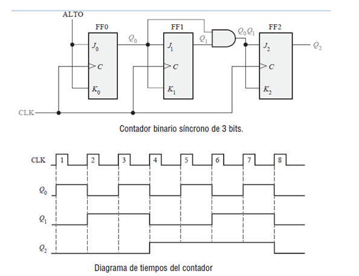

<b> Universidad Escuela Colombiana de Ingeniería Julio Garavito</b>
 

Henry Moreno Mosquera
 

Profesor del Centro de Estudios Electrónicos
 

henry.moreno@escuelaing.edu.co
 

# **CURSO DE ELECTRONICA BASICA PARA INGENIEROS. MODULO 2. LOGICA SECUENCIAL**

## Introducción.

La lógica secuencial es un área de la electrónica digital y la lógica computacional que se ocupa del diseño y análisis de sistemas o circuitos que operan en secuencia, es decir, toman en cuenta eventos y condiciones pasados para determinar su comportamiento futuro. En contraste, la lógica combinacional solo depende de las entradas actuales y produce salidas independientes de los estados anteriores.

Los sistemas secuenciales son ampliamente utilizados en dispositivos electrónicos, computadoras, controladores, microprocesadores y otros circuitos digitales que necesitan mantener estados y recordar información. La lógica secuencial utiliza elementos de memoria, como biestables o flip-flops, para almacenar bits de información y tener en cuenta el historial de estados.

Los principales componentes de la lógica secuencial son:

Biestables (Flip-flops): Son dispositivos de almacenamiento que tienen dos estados estables (0 y 1). Estos biestables pueden ser del tipo D, JK, SR, T, entre otros. Se utilizan para mantener estados y almacenar información.

Temporizadores y contadores: Son circuitos secuenciales que se utilizan para medir el tiempo o contar eventos. Los temporizadores generan señales de reloj con una frecuencia determinada, mientras que los contadores cuentan la cantidad de pulsos de entrada.

Registros de desplazamiento: Son circuitos que permiten mover los bits de una entrada a lo largo de una cadena de biestables. Se utilizan para tareas como desplazamiento de datos o implementación de registros de almacenamiento de datos.

Máquinas de estados: Son sistemas secuenciales que cambian de estado en respuesta a entradas específicas y producen salidas según el estado actual. Las máquinas de estados se utilizan ampliamente en el diseño de controladores y protocolos de comunicación.

La lógica secuencial se implementa utilizando circuitos lógicos, como compuertas lógicas y multiplexores, combinados con elementos de memoria para mantener estados. El comportamiento de los circuitos secuenciales se puede describir mediante diagramas de tiempo, tablas de transición y diagramas de estados.

Es importante tener en cuenta que el diseño y análisis de sistemas secuenciales pueden ser complejos debido a la posibilidad de generar comportamientos no deseados, como carreras o conflictos. Por lo tanto, los diseñadores deben aplicar técnicas y metodologías para garantizar el correcto funcionamiento de los circuitos secuenciales.

## Contadores

### Contadores Asíncronos (o de rizo). 

Son aquellos donde el pulso de reloj no le llega al mismo tiempo a todos los Flip_Flop, sino que cada reloj depende de las salidas de los bits vecinos a su derecha (LSB).

###Contadores Síncronos. 

Son aquellos donde el pulso de reloj les llega al mismo tiempo a todos los Flip_Flop, sin embargo, las entradas van variando de acuerdo al estado, haciendo que en unos casos hagan una tarea y en otros casos realice otra tarea

  

  

### Contadores Síncronos.

El término síncrono se refiere a los eventos que tienen una relación temporal fija entre sí. Un contador síncrono es aquel en el que todos los flip-flops del contador reciben en el mismo instante la señal de reloj.

  

Eldiarama implementado sería:

  

### Contador sincrono acendente/descendente

Se debe tener un interruptor que seleccione si para cada bit se toma la salida del flip_flop normal o negada. Puede ser un MUX 2x1 o en su defecto una compuerta XOR con la salida de cada bit

  

## Registros de Almacenamiento

## Memorias RAM

### Control de versiones

| Versión    | Descripción   | Autor                                      | Horas |
|------------|:--------------|--------------------------------------------|:-----:|
| 2023.07.31| Versión No. 1 | [Henry Moreno](https://github.com/hmorenom64)  |  6 |

_Curso Electronica Básica para Ingenieros es de uso libre para fines académicos.

_¡Encontraste útil este repositorio!, apoya su difusión marcando este repositorio con una ⭐ o síguenos dando clic en el botón Follow de [hmorenom64](https://github.com/hmorenom64?tab=repositories) en GitHub._

| [Anterior](logica_combinacional.md)| [:house: Inicio](../readme.md) | [:beginner: Ayuda / Colabora] | [Siguiente](conversor_AD_DA.md) |
|----------------------------|-----------------------------------|--------------------------------------------------------------------------------------------------|-----------------------------------------|
                                                                                                                                      
                                                                                                                                

                                                                                                                                      
##
