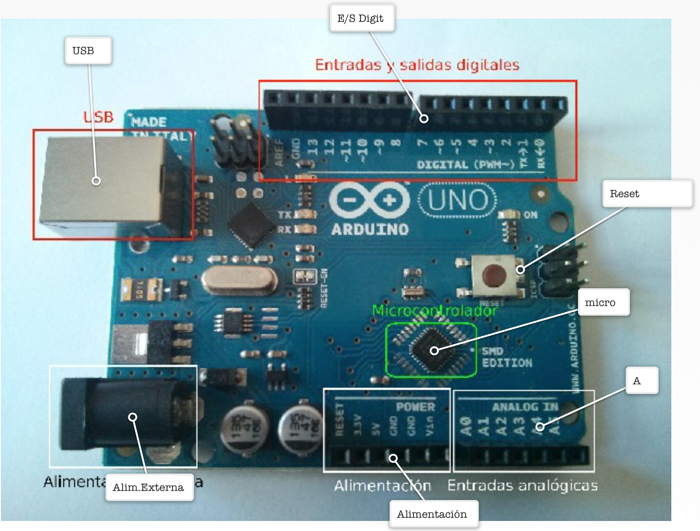
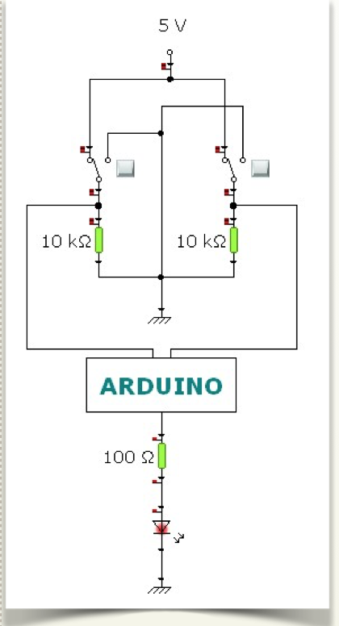
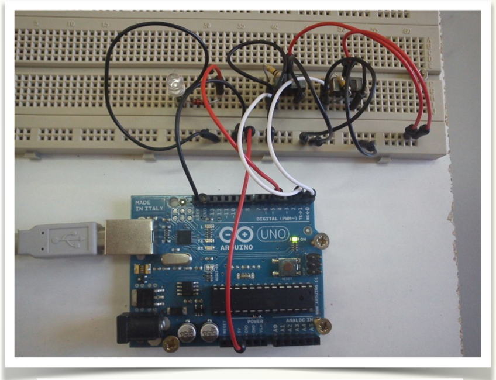
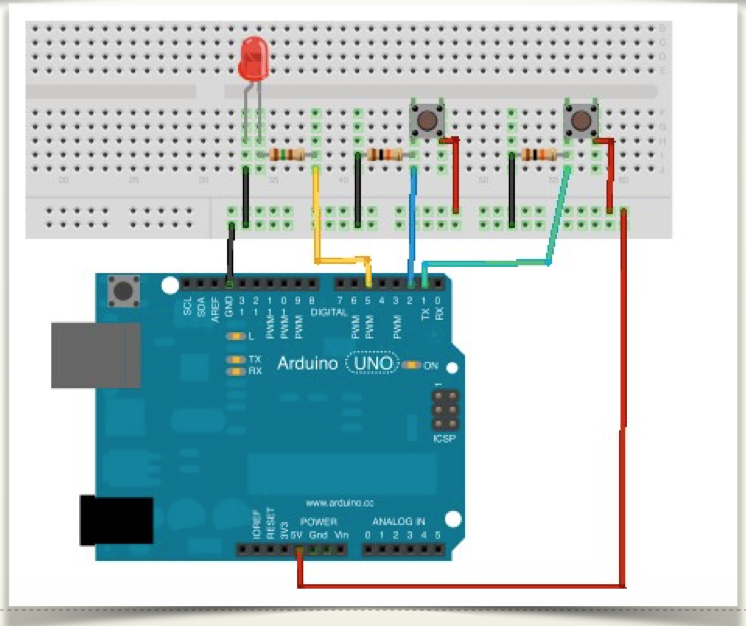
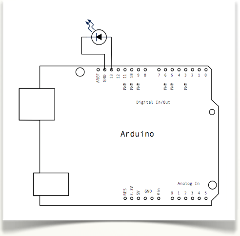
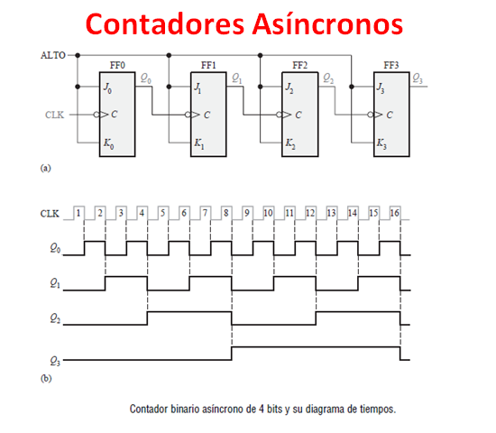

<div align="center">

</div>

<div align="center">
<b> Universidad Escuela Colombiana de Ingeniería Julio Garavito</b>
<br></div>

<div align="center">
Henry Moreno Mosquera
<br></div>

<div align="center">
Profesor del Centro de Estudios Electrónicos
<br></div>

<div align="center">
henry.moreno@escuelaing.edu.co
<br></div>


# **CURSO DE ELECTRONICA BASICA PARA INGENIEROS. MODULO 2. SISTEMAS MICROCONTROLADOS**

# Información básica sobre Arduino

### **¿Qué es Arduino?**

Arduino es una tarjeta electrónica que integra básicamente a un microcontrolador y un conjunto de pines de conexión de entradas y salidas que permiten, mediante un determinado programa, interaccionar con el medio físico mediante sensores y actuadores electrónicos. De esta forma podrás crear tus propios proyectos tecnológicos, dotarlos de sensores que detecten magnitudes físicas como luz, calor, fuerza, etc… y en base a esa información, escribiendo un programa, activar otros dispositivos (actuadores) como pequeñas bombillas, ledes, servomotores, pequeños motores DC, relés, etc… Los sensores se conectan a los pines de entrada y los actuadores a los de salida.


### **¿Qué es un microcontrolador?**

Es un circuito integrado que se puede programar, o sea que puede ejecutar las órdenes que tenga almacenadas en su memoria. Tiene las tres funciones principales de un computador: la unidad central de proceso, memoria y entradas y salidas.

Arduino utiliza la marca ATMEL, y el modelo de microcontrolador depende del tipo de tarjeta, por ejemplo la tarjeta Arduino Uno utiliza el micro ATMEL MEGA 328P.

### **¿Qué se puede hacer con Arduino, algún ejemplo?**

<div align="center">
  
</div>

Realmente el límite lo marca tu imaginación pero por dar alguna pista, podrías diseñar un sistema para la apertura y cierre de la puerta de un garaje, hacer un robot móvil que detecte objetos o que siga una línea negra, crear un detector de luz y oscuridad, implementar un termómetro, controlar un cilindro neumático, etc…

En este manual tienes múltiples ejemplos de pequeños proyectos para el aula, aunque Arduino es una herramienta que también se utiliza en el ámbito profesional para monitorización de sensores y automatización a pequeña escala por su flexibilidad, fiabilidad y precio.

### **¿Qué son las entradas y salidas?**

Mediante los conectores de Arduino correspondientes a las entradas y salidas podemos comunicar nuestros programas con el “mundo exterior”. Si queremos leer el valor de la magnitud física medida por un sensor, por ejemplo una LDR que detecta el nivel de luminosidad, lo tendremos que hacer conectando el sensor a uno de los pines de entrada (en este caso analógicas) de la tarjeta.

De esta forma con una simple instrucción de lectura en el programa, podremos obtener el valor de la magnitud física. Si nuestra intención es actuar o “hacer algo” una vez leído el valor del sensor, por ejemplo encender un led si el sensor de luminosidad detecta oscuridad, tendremos que conectar el actuador (en este caso el led) a un pin de salida que proporcionará la corriente necesaria para activarlo.

En Arduino las entradas pueden ser analógicas o digitales y las salidas sólo digitales. Cada pin digital tiene doble función entrada o salida. En la zona de configuración del programa hay que indicar explícitamente mediante una instrucción cuál es función desempeña un determinado pin.

### **¿Dónde se conectan los sensores a las entradas analógicas o digitales?**

Los sensores utilizados en los proyectos que vamos a utilizar son de salida analógica, es decir proporcionan una variación de voltaje dentro de un rango (normalmente de 0 a +5V) dependiendo de lo que varíe la magnitud física medida. Muchos sensores son resistivos (luz, temperatura, humedad,…), es decir que varían su resistencia eléctrica con la magnitud física, pero mediante un sencillo montaje de divisor de tensión conseguimos una variación de voltaje apta para Arduino. Estos montajes los veremos en las prácticas del manual.

Una vez realizadas las conexiones, si midiéramos la salida del sensor con un voltímetro nos daría un valor decimal, por ejemplo un nivel de luz “intermedio” (rango de 0 a 5V) de un sensor de luz podría dar 3,3 voltios. Este tipo de información el microcontrolador no la entiende tal cual, sólo es capaz de interpretar números binarios (“0” ó “1”) por lo que para traducir los valores analógicos dispone internamente de un conversor analógico – digital que hará la conversión entre los dos sistemas, de forma que podremos tener valores discretos de la medida de los sensores analógicos.

**Las entradas analógicas** leen valores analógicos entre 0V y la alimentación (normalmente 0-5V) y lo convierte en números entre **0 y 1024**.

### Entonces, ¿qué utilidad tienen las entradas digitales?

Las entradas digitales son útiles cuando las señales a leer son valores discretos. Por ejemplo queremos poner un pulsador o un interruptor que encienda un led. Hacemos un montaje que cuando se pulse, entren 5 voltios en el pin digital de entrada y cuando no se pulse que “entren” 0 voltios. De esta manera la lectura del pin digital de entrada será “HIGH” con 5 voltios o “LOW” con 0 voltios.

### **¿Qué son las salidas digitales etiquetadas con PWM (~)?**

Son salidas digitales que simulan una salida analógica. Las siglas significan Modulación por Ancho de Pulso (Pulse Width Modulation) o proporcionan una onda cuadrada con un nivel alto (+5V) de “cierta” duración.

**Los valores PWM** que podemos proporcionar pueden ir desde **0 a 255** que corresponderían a un 0V analógico y a la máxima tensión (la de alimentación, normalmente 5V). 

Es muy útil para activar servomotores y llevarlos a una posición determinada o variar la luminosidad de un led. Lo puedes ver más explicado en la siguiente sección.

### **¿Puedo accionar motores DC con Arduino?**

Si son motores muy pequeños sí sería posible aunque no es recomendable. Los motores necesitan un consumo alto de corriente, sobre todo si tienen que mover cierta carga, por lo que se recomienda o bien utilizar una tarjeta Shield o extensión de Arduino que dispone de circuitería apta para proporcionar dicha corriente (transistores). En este manual utilizamos una Shield bautizada como Edubásica de elaboración propia que dispone de un transistor y un circuito integrado LM293 para realizar esta función, además de otras ventajas para el aprendizaje de Arduino.

## Ejemplo 1. Implementación compuerta AND


## PULSADORES:

Vamos a simular dos entradas lógicas (“1” ó “0”) con dos pulsadores, (pueden ser conmutadores). En este ejemplo usaremos la función AND de manera que, según el estado de las 2 entradas, obtendremos una señal de salida (“1” ó “0”) conforme a la tabla de verdad de la operación. Si te animas puedes montar el circuito tú mismo en una protoboard siguiendo este esquema:

Las entradas están en los pines digitales 1 y 2. Y la salida del sistema es un led (en pin 5) que estará encendido/apagado según el resultado de aplicar la función AND a las 2 variables de entrada.

<div align="center">
  
</div>

<div align="center">
  
</div>

<div align="center">
  
</div>

## **PROGRAMA:**

```cpp
/*
  Boole
  Función AND con 2 variables
 */

int var1 = 7;   //Pin de entrada del pulsador 1
int var2 = 2;   //Pin de entrada del pulsador 1
int led = 5;    //Pin de salida para el led(rojo)
int estado1 = 0;    //Para almacenar el estado de la variable1
int estado2 = 0;    //Para almacenar el estado de la variable2
int resultado = 0;  //Para almacenar el resultado      

void setup() {
  pinMode(var1, INPUT);     //Iniciliza el pin de entrada 1 como salida
  pinMode(var2, INPUT);     //Iniciliza el pin de entrada 2 como salida  
  pinMode(led, OUTPUT);     //Iniciliza el pin del led como salida 
}

void loop(){
  estado1 = digitalRead(var1);  //Lee el estado del botón y lo almacena
  estado2 = digitalRead(var2);  //Lee el estado del botón y lo almacena
  resultado = (estado1 && estado2); //Función AND con los dos estados
  digitalWrite(led, resultado);    //Escribimos el resultado en el led
}
```

## Ejemplo 2. LED parpadeante sin EDUBASICA

Vamos a controlar el encendido y apagado de un led conectado al pin13 de Arduino. 

¿Por qué el pin13 y no otro? Podríamos hacerlo con otro, pero el pin13 tiene asociado un led en la placa justo debajo de el y así nos evitamos tener que montar. Si pusiéramos un pin polarizado correctamente entre el pin13 y GND también funcionaría. El pin13 tiene también una resistencia que hace posible conectarle un led directamente, si hacemos el montaje con otro pin debemos añadir esta resistencia de 10Kohm entre el led y el pin.

>Acuérdate: La pata más larga del LED es el (+) por lo tanto en el D13 y el corto (-) en GND.

<div align="center">
  
</div>

```cpp+lineNumbers:true
void setup() {                
  // inicializamos el pin 13 
  // para que sea de salida
  pinMode(13, OUTPUT);     
}
// Definimos la rutina cíclica
void loop() {
  digitalWrite(13, HIGH);   // Encendemos el pin13
  delay(1000);              // esperamos 1 segundo
  digitalWrite(13, LOW);    // Apagamos el pin13  
delay(1000);                // esperamos 1 segundo
}
```

Todo lo que está entre las llaves de **loop()**, se ejecuta indefinidamente. Así vemos un efecto de led parpadeante ya que si analizamos las líneas del código vemos que el proceso es:

- Encendemos.
- Esperamos un segundo.
- Apagamos.
- Esperamos un segundo.  

## Ejemplo 3. Alarma


**Enunciado: Cuando el LDR esté tapado, tiene que sonar un pitido intermitente de un segundo, con visualización también en los LEDs**


Hay que poner el LDR en A1, las luces (por simplicidad uno), el altavoz y el transistor con la conexión en la base por D5:

<div align="center">
  
</div>


##Programa:

```cpp+lineNumbers:true
void setup() {
  pinMode(6, OUTPUT);
  pinMode(3, OUTPUT); 
  pinMode(4, OUTPUT); 
  pinMode(5, OUTPUT); 
  Serial.begin(9600);
  
}

void loop() {
  Serial.print("valor analogico leido=");Serial.println(analogRead(1));  //así visualizamos los valores y determinamos cuando es oscuro o no
  ///////////////////////////////////////////////////////////////////////////////////////////////////////////////////////
  if (analogRead(1)<950 ){    // LDR NO TAPADO: NO SALTA LA ALARMA
    digitalWrite(3, LOW);  digitalWrite(4, LOW); digitalWrite(5, LOW); // Se apagan los TRES LEDS
    digitalWrite(6, LOW);                                             //Se apaga el altavoz
  }else{                      /// LDR TAPADO, SALTA LA ALARMA 
    digitalWrite(3, HIGH);  digitalWrite(4, HIGH); digitalWrite(5, HIGH); // Se enciende los TRES LEDS: 
    /////////////////////////////////////////////////SUENA LA ALARMA durante un segundo 1ms x 1000 = 1 seg ////////////////////
    for (int j=0;j<1000;j++){
           digitalWrite(6, HIGH);   // Encendemos e
          delay(1);              // esperamos 1 segundo
          digitalWrite(6, LOW);    // Apagamos el pin13  
          delay(1);        
    }
    digitalWrite(3, LOW);  digitalWrite(4, LOW); digitalWrite(5, LOW); // Se apagan los TRES LEDS
    digitalWrite(6, LOW);                                             //Se apaga el altavoz
    delay(1000);
  }  
}
```

### Control de versiones

| Versión    | Descripción   | Autor                                      | Horas |
|------------|:--------------|--------------------------------------------|:-----:|
| 2023.07.31| Versión No. 1 | [Henry Moreno](https://github.com/hmorenom64)  |  6 |

_Curso Electronica Básica para Ingenieros es de uso libre para fines académicos.

_¡Encontraste útil este repositorio!, apoya su difusión marcando este repositorio con una ⭐ o síguenos dando clic en el botón Follow de [hmorenom64](https://github.com/hmorenom64?tab=repositories) en GitHub._

| [Anterior](conversor_AD_DA.md)| [:house: Inicio](../readme.md) | [:beginner: Ayuda / Colabora] | [Siguiente](sistemas_myDAQ.md) |
|----------------------------|-----------------------------------|--------------------------------------------------------------------------------------------------|-----------------------------------------|
                                                                                                                                      
                                                                                                                                
<div align="center"><a href="https://enlace-academico.escuelaing.edu.co/psc/FORMULARIO/EMPLOYEE/SA/c/EC_LOCALIZACION_RE.LC_FRM_ADMEDCO_FL.GBL" target="_blank"></a></div>
                                                                                                                                      
##
