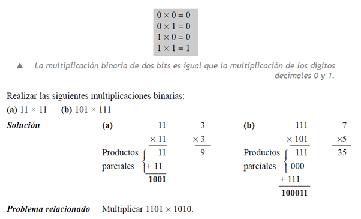

<b> Universidad Escuela Colombiana de Ingeniería Julio Garavito</b>
 

Henry Moreno Mosquera
 

Profesor del Centro de Estudios Electrónicos
 

henry.moreno@escuelaing.edu.co
 

# **CURSO DE ELECTRONICA BASICA PARA INGENIEROS. MODULO 2. SISTEMA DE NUMERACION BINARIA**

## SISTEMA DE NUMERACIÓN BINARIA

El sistema de numeración binario es simplemente otra forma de representar magnitudes. Es menos complicado que el sistema decimal porque sólo emplea dos dígitos. El sistema decimal con sus diez dígitos es un sistema en base diez; el sistema binario con sus dos dígitos es un sistema en base dos. Los dos dígitos binarios (bits) son 1 y 0. La posición de un 1 o un 0 en un número binario indica su peso; o valor dentro del número, del mismo modo que la posición de un dígito decimal determina el valor de ese dígito. Los pesos de un número binario se basan en las potencias de dos. Se puede hablar de ON-OFF, Falso-Verdadero, Alto-Bajo, etc.

  

### TABLA ASOCIADA DE DECIMAL A BINARIO

  

#### CONVERSIÓN DE DECIMAL A BINARIO

Convertir un número decimal al sistema binario es muy sencillo: debemos  realizar divisiones por 2 colocando el resto y volviendo a dividir el cociente  por 2 así sucesivamente hasta no tener dividendo.
Por ejemplo, para convertir al sistema binario el número 2210 haremos una  serie de divisiones que entrega  los restos siguientes:

  

Tomando los restos en orden inverso o sea de abajo hacia arriba obtenemos las cifras binaria que es:

  

#### EJEMPLOS

  

### CONVERSION DE BINARIO A DECIMAL

El proceso para convertir un número del sistema binario al decimal es aún  más sencillo; teniendo en cuenta el valor de cada dígito en su posición, que  es la de una potencia , cuyo exponente es 0 en el bit situado más a la  derecha, y se aumenta en una unidad en el exponente según vamos  avanzando posiciones hacia la izquierda.

Por ejemplo, para convertir el número binario 10111(2) a decimal, lo desarrollamos teniendo en cuenta el valor de cada bit:

  

#### EJERCICIOS

  

### CONVERSIÓN DE FRACCIONES DECIMALES A BINARIO

Por el método de multiplicaciones por 2 y tomando el entero y seguir aplicándole el mismo proceso al residuo

  

### ARITMETICA BINARIA

  

  

En el caso de la resta, se debería seguir el mismo procedimiento tradicional para realizar la operación. 

  

### COMPLEMENTO A 1

El complemento a 1 en la aritmética binaria consiste en hallar bit a bit en forma separada, cuanto le faltaría para llegar a 1. Cuando tengo un 0, le faltará 1 para llegar a 1. Cuando tengo un 1, le faltará 0 para llegar a 1.

Si se hace una analogía con el sistema decimal, en este caso sería el complemento a 9, que es el máximo valor que puede tener un símbolo. De esta forma tenemos que el complemento a 9 de 2537 será 7462, ya que lo que le falta a 2 para llegar a 9 es 7, lo que le falta a 5 para llegar a 9 es 4 y así sucesivamente

En el caso binario, el complemento a 1 del número 10110  será 01001.

Observemos que en este caso en particular, podemos introducir el término “negación” o “negado”. La negación de falso es verdadero, la negación de alto es bajo, la negación de si es no, la negación de on es off, y así sucesivamente. La negación de 0 será 1 y la negación de 1 será 0

Es decir, para calcular el complemento a 1 de un número consiste en “negar” cada uno de los símbolos que hacen parte del número en forma separada.
Electrónicamente es muy sencillo implementar la función de negación.

### COMPLEMENTO A 2

El complemento a 2, es fácil entenderlo si analizamos el complemento a 10 del sistema decimal. El complemento a 10 de un dato decimal, es el valor que hace falta para llegar a la potencia de 10 mas cercana. Por ejemplo, el complemento a 10 de 64 es 36, ya que 64 + 36 =100. El complemento a 10 de 811 es 189, ya que 811 + 189 = 1000

Otra forma de calcularla es hallar el complemento a 9 y sumarle 1. Comp_10 = Comp_9 + 1

De la misma forma, El complemento a 2, es hallar el complemento a 1 y sumarle 1.

Comp_2 = Comp_1 + 1

El complemento a 2 de 1011 es: 0100 + 1 = 0101

El número 1011(2)  es 11(10), y la potencia en 2 mas cercana a 11 es 16. Por lo tanto le faltaría 5 para llegar a 16. Y 5 se escribe 0101

El complemento a 2 de 10110111 es: 01001000 + 1 = 01001001

10110111(2)es 183(10) y la potencia mas cercana es 256, lo que le falta a 183 es 73. 

73(10) = 01001001(2)

### MULTIPLICACION BINARIA

Las reglas de multiplicación son:

  

### NUMEROS CON SIGNO

La primera representación es Signo-Magnitud, en donde el bit MSB corresponderá al signo (0 positivo y 1 negativo) y los bits corresponderán a la magnitud.  Pensemos en un sistema de 4 bits. En este caso los bits 2, 1 y 0 serán la magnitud y el b3 será el signo

  

### REPRESENTACION NUMEROS NEGATIVOS COMO COMPLEMENTO A 2

Para representar los números negativos, existe también la forma de representarlos como su complemento a 2. De esta forma es como trabajan todos los sistemas electrónicos digitales. El número positivo mantiene su representación de signo – magnitud, mientras que el número negativo es en C2.

Ejemplos: En todos los casos asumimos 8 bits de tamaño.
-25 .  El número original es 00011001. El C1 es 11100110. El C2 es 11100110 + 1 = 11100111
-70. El número original es 01000110. El C1 es 10111001. El C2 es 10111010

Como hay que reservar el MSB para el signo, solamente podemos representar  2^7 valores diferentes. Es decir de 0 hasta 127 positivos. En este caso, tendremos igualmente 2^7 valores diferentes para los negativos. Desde -128 hasta -1. En este caso no hay -0.  Si intentamos representarlo sería: 00000000 y luego C1 será 11111111 y el C2 11111111 + 1 = 100000000. Pero como el máximo tamaño es de 8 bits, tendríamos 00000000

### RESTA CON NÚMEROS REPRESENTADOS MEDIANTE COMPLEMENTO A 2

Esta es la forma como los sistemas digitales realizan la resta. La idea es representar el sustraendo en forma de signo – complemento a 2, dejando el minuendo tal como está. Posteriormente se suman las dos cifras.
Veamos varios casos: ( en todos tendremos 5 bits)
Restar  7 – 4
 -4 = 00100 -> 11011 -> 11100

 

  

 

  

### GENERALIZACION DE LA OPERACIÓN CON SIGNOS

 

  

### NUMEROS HEXADECIMALES

El sistema de numeración hexadecimal consta de dieciséis caracteres y se usan fundamentalmente como una forma simplificada de representar o escribir los números binarios, ya que es muy fácil la conversión entre binario y hexadecimal. Como probablemente habrá comprobado, los números binarios largos son difíciles de leer y escribir, ya que es fácil omitir o transponer un bit. Puesto que las computadores y microprocesadores sólo entienden los 1s y los 0s, es necesario emplear estos dígitos cuando se programa en “lenguaje máquina”. Imagine tener que escribir una instrucción de sesenta bits para un sistema de microprocesador utilizando 1s y 0s. Es mucho más efectivo utilizar los números hexadecimales. El sistema hexadecimal se usa frecuentemente en computadoras y aplicaciones de microprocesadores.

 

  

### Control de versiones

| Versión    | Descripción   | Autor                                      | Horas |
|------------|:--------------|--------------------------------------------|:-----:|
| 2023.07.31| Versión No. 1 | [Henry Moreno](https://github.com/hmorenom64)  |  6 |

_Curso Electronica Básica para Ingenieros es de uso libre para fines académicos.

_¡Encontraste útil este repositorio!, apoya su difusión marcando este repositorio con una ⭐ o síguenos dando clic en el botón Follow de [hmorenom64](https://github.com/hmorenom64?tab=repositories) en GitHub._

| [Anterior](../readme.md) | [:house: Inicio](../readme.md) | [:beginner: Ayuda / Colabora] | [Siguiente](../readme.md) |
|----------------------------|-----------------------------------|--------------------------------------------------------------------------------------------------|-----------------------------------------|
                                                                                                                                      
                                                                                                                                

                                                                                                                                      
##

