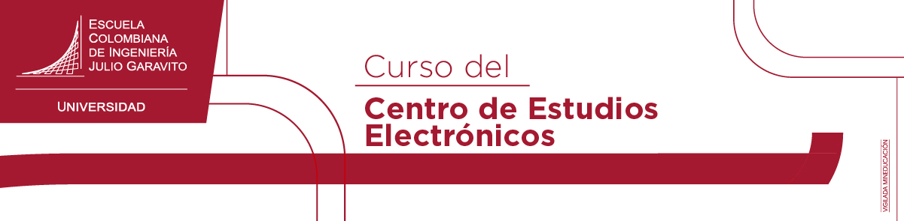
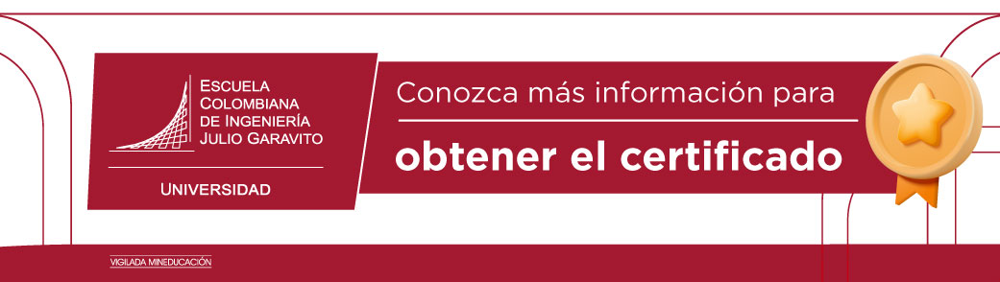

<b> Universidad Escuela Colombiana de Ingeniería Julio Garavito</b>
 

Henry Moreno Mosquera
 

Profesor del Centro de Estudios Electrónicos
 

https://github.com/hmorenom64/electronica_basica/blob/main/readme.md
henry.moreno@escuelaing.edu.co
 

## **CURSO DE FUNDAMENTOS DE ELECTRONICA PARA INGENIEROS**

 

## **INTRODUCCION**

Hoy en día en la mayoría de las disciplinas de la Ingeniería se ha ido involucrando la Electrónica como un componente esencial en el desarrollo de soluciones específicas. Es por esta razón que la mayoría de programas curriculares han venido introduciendo algunas asignaturas de formación que buscan que los ingenieros tengan conocimientos básicos en las diferentes áreas de la Electrónica, para poder comprender la funcionalidad de equipos, tanto de medición, como de toma de datos, sensores, actuadores y otros elementos que permiten establecer soluciones prácticas optimas y útiles para las diferentes necesidades.

Es por esta razón que este curso va encaminado a dar una guía de aprendizaje muy sencillo, sin tanta teoría profunda, buscando más la operación y funcionamiento de las soluciones, que la particularidad de los componentes electrónicos.

## **A QUIEN VA DIRIGIDO**

El curso va dirigido a ingenieros de diferentes áreas que en su formación no hayan tenido ningún curso básico de Electrónica. Igualmente puede ser tomado por profesionales de áreas diferentes a la Ingeniería. 

## **OBJETIVO PRINCIPAL DEL CURSO**

El objetivo principal del curso es que los ingenieros y demás profesionales que tengan la oportunidad de adquirir los conocimiento básicos de la Electrónica Análoga Básica y la Electrónica Digital, en forma aplicada, con lo cual puedan fácilmente realizar soluciones sencillas para problemas cotidianos, tanto en su ambiente de trabajo como en su día a día, sin necesidad de tener que adquirir conocimientos específicos, usando herramientas de Hardware y Software modulares, comunes hoy en día en la industria electrónica, que se han venido vuelto muy utilizados en temas como la IoT (Internet de las cosas) o la IABO( inteligencia Artificial de borde).

## **OBJETIVOS ESPECIFICOS DEL CURSO**

- Entender las diferentes áreas de la Electrónica
- Comprender en qué casos se usa una tecnología específica
- Apropiarse del concepto de Adquisición de datos y señales con HW y SW
- Analizar datos a través de herramientas de SW propias para aplicaciones electrónicas
- Diseñar soluciones básicas con componentes electrónicos análogos (Amp. Op.)
- Diseñar soluciones básicas con componentes digitales sencillos microcontrolados (Arduino, MyDAQ, MyRIO)
- Comprender el uso  y la manipulación de algunos sensores de interés
- Controlar algunos elementos actuadores y motores específicos (Motores Step, Servomotores, Motores DC)

## **CONTENIDO PROGRAMATICO**

El curso está dividido en tres módulos, para permitir que el estudiante en forma gradual y modular vaya avanzando en cada uno de los aspectos relevantes.

Al finalizar el curso, el estudiante tendrá la capacidad de implementar soluciones típicas, muy comunes hoy en día en temas como la instrumentación de procesos, IoT y otras áreas generales.

A continuación se presenta cada uno de los diferentes módulos, con sus respectivas actividades y alcances de las mismas

## **Módulo 1. – Electrónica Análoga**

|Actividad|Alcance|
| :-: | :-: |
|[Conceptos de Voltaje, Corriente y Potencia. Conceptos de DC y AC](modulo_1/conceptos_basicos.md)  |Descripción de los conceptos esenciales de la electrónica y la Electricidad, como son el voltaje, la corriente y la potencia, haciendo uso de ecuaciones muy sencillas, y estableciendo sus diferencias. Identificación de las diferencias existentes entre Corriente Directa y Alterna. Igualmente la forma como se pueden lograr la una a partir de la otra, y sus aplicaciones en los problemas cotidianos|
|[Tutorial Multisim](modulo_1/tutorial_multisim.md)|Se observará un tutorial escrito y video para que se pueda entender la manipulación del mismo|
|[Circuitos Resistivos en DC](modulo_1/circuitos_resistivos.md)|Ilustración de los diferentes modos de circuitos, así como sus diferentes métodos de análisis y la implementación en simulación|
|[Circuitos pasivos RLC en AC](modulo_1/circuitos_RLC.md)|Análisis de los circuitos RLC, identificando el efecto de la frecuencia en los mismos y su comportamiento típico, lo que lleva a entender el concepto de filtro|
|[Diodos: conceptos, tipos, y uso de los mismos](modulo_1/diodos.md)|Comprender el concepto de un elemento semiconductor. Apropiación del concepto del Diodo y sus diferentes tipos. Igualmente se revisarán algunos circuitos típicos y sus diferentes aplicaciones|
|[Amplificadores Operacionales: Conceptos, circuitos típicos implementados con Amp. Op.](modulo_1/amplificadores.md)|Se dará alcance al concepto de amplificación de señales y su importancia en la electrónica. Se revisará el funcionamiento del Amplificador Operacional como elemento integrado. De la misma forma se revisarán algunos de sus usos y su implementación en los circuitos típicos, tanto de amplificación como de filtrado|

## **Módulo 2. – Electrónica Digital**

|Actividad|Alcance|
| :-: | :-: |
|[Sistema Numeración Binaria](modulo_2/numeracion_binaria.md)|Diferenciar los distintos sistemas de numeración, y la importancia de la codificación binaria|
|[Algebra Booleana](modulo_2/algebra_booleana.md)|Apropiación de los principios fundamentales del algebra booleana y la forma de modelar y simplificar funciones digitales|
|[Circuitos y Lógica Combinacional](modulo_2/logica_combinacional.md)|Entender la funcionalidad de los sistemas combinacionales y los problemas que se pueden atender mediante este esquema de solución.|
|[Circuitos y Lógica secuencial](modulo_2/logica_secuencial.md)|Solucionar problemas típicos de la lógica secuencial con contadores, registros y dispositivos de almacenamiento temporal|
|[Conversión A/D y D/A](modulo_2/conversor_AD_DA.md)|Entender el concepto de los valores análogos, de donde provienen y como se pueden representar mediante códigos binarios, y el HW que se requiere para poder convertir en forma bidireccional dichos valores|
|[Implementación de soluciones con sistemas microcontrolados](modulo_2/microcontrol.md)|Con el uso de Arduino se realizarán las aplicaciones que se realizaron en forma secuencial  y combinacional|
|[Sistemas implementados con MyDAQ](modulo_2/sistemas_myDAQ.md)|Usar la tarjeta MyDAQ de National Instruments, se implementan soluciones digitales mediante LabVIEW|
|[Sistemas implementados con MyRIO](modulo_2/sistemas_MYRIO.md)|Usar la tarjeta MyRIO de National Instruments, se implementan soluciones digitales mediante LabVIEW|

## **Módulo 3. – Soluciones industriales típicas**

|Actividad|Alcance|
| :-: | :-: |
|[Control de motores SERVOS](modulo_3/control_servvos).md)|Con el uso de un motor sencillo SERVO se desarrollarán aplicaciones para controlar el motor, tanto en posición como en velocidad. Se hará uso de MyDAQ, MyRIO y Arduino|
|[Control de motores STEP TO STEP](modulo_3/control_step.md|Con el uso de un motor sencillo STEP TO STEP se desarrollarán aplicaciones para controlar el motor, tanto en posición como en velocidad. Se hará uso de MyDAQ, MyRIO y Arduino|
|[Sensores típicos usados en la Electrónica (Arduino)](modulo_3/sensores.md)|Con el uso de los diferentes elementos de HW se desarrollarán aplicaciones de sensores típicos, como Temperatura, Fotorresistencias y otros sensores típicos de la electrónica (Acelerómetros)|

## **MATERIAL DEL CURSO POR MÓDULOS. NOTAS ACLARATORIAS**

Tal como se describió anteriormente, se recomienda que el estudiante revise, estudie y analice la información contenida en cada actividad, siguiendo el orden definido en el contenido programático. En el caso que el estudiante requiera la certificación del curso, este deberá realizar las actividades y presentarlas al tutor siguiendo las instrucciones del caso, en los tiempos establecidos.

